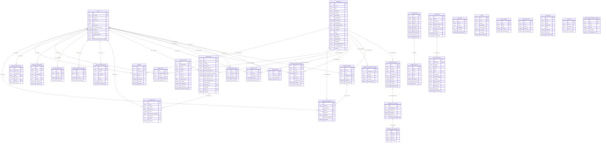

```mermaid
erDiagram
    workspaces ||--o{ workspace_documents : "(id) - (workspaceId)"
    users ||--o{ recovery_codes : "(id) - (user_id)"
    users ||--o{ password_reset_tokens : "(id) - (user_id)"
    workspaces ||--o{ workspace_threads : "(id) - (workspace_id)"
    users |o--o{ workspace_threads : "(id) - (user_id)"
    workspaces ||--o{ workspace_suggested_messages : "(id) - (workspaceId)"
    users |o--o{ workspace_chats : "(id) - (user_id)"
    users |o--o{ workspace_agent_invocations : "(id) - (user_id)"
    workspaces ||--o{ workspace_agent_invocations : "(id) - (workspace_id)"
    workspaces ||--o{ workspace_users : "(id) - (workspace_id)"
    users ||--o{ workspace_users : "(id) - (user_id)"
    workspaces ||--o{ embed_configs : "(id) - (workspace_id)"
    users |o--o{ embed_configs : "(id) - (usersId)"
    embed_configs ||--o{ embed_chats : "(id) - (embed_id)"
    users |o--o{ embed_chats : "(id) - (usersId)"
    users |o--o{ slash_command_presets : "(id) - (userId)"
    workspace_documents |o--o| document_sync_queues : "(id) - (workspaceDocId)"
    document_sync_queues ||--o{ document_sync_executions : "(id) - (queueId)"
    users |o--o{ browser_extension_api_keys : "(id) - (user_id)"
    users ||--o{ temporary_auth_tokens : "(id) - (userId)"
    users |o--o{ system_prompt_variables : "(id) - (userId)"
    workspaces ||--o{ prompt_history : "(id) - (workspaceId)"
    users |o--o{ prompt_history : "(id) - (modifiedBy)"
    users |o--o{ desktop_mobile_devices : "(id) - (userId)"
    workspaces ||--o{ workspace_parsed_files : "(id) - (workspaceId)"
    users |o--o{ workspace_parsed_files : "(id) - (userId)"
    workspace_threads |o--o{ workspace_parsed_files : "(id) - (threadId)"
    scheduled_jobs ||--o{ scheduled_job_runs : "(id) - (jobId)"
    users |o--o{ memories : "(id) - (userId)"
    workspaces |o--o{ memories : "(id) - (workspaceId)"
    model_routers ||--o{ model_router_rules : "(id) - (router_id)"
    api_keys {
        int id PK
        string name
        string secret UK
        int createdBy
        datetime createdAt
        datetime lastUpdatedAt
    }
    workspace_documents {
        int id PK
        string docId UK
        string filename
        string docpath
        int workspaceId FK
        string metadata
        boolean pinned
        boolean watched
        datetime createdAt
        datetime lastUpdatedAt
    }
    invites {
        int id PK
        string code UK
        string status
        int claimedBy
        string workspaceIds
        datetime createdAt
        int createdBy
        datetime lastUpdatedAt
    }
    system_settings {
        int id PK
        string label UK
        string value
        datetime createdAt
        datetime lastUpdatedAt
    }
    users {
        int id PK
        string username UK
        string password
        string pfpFilename
        string role
        int suspended
        boolean seen_recovery_codes
        datetime createdAt
        datetime lastUpdatedAt
        int dailyMessageLimit
        string bio
        string web_push_subscription_config
    }
    recovery_codes {
        int id PK
        int user_id FK
        string code_hash
        datetime createdAt
    }
    password_reset_tokens {
        int id PK
        int user_id FK
        string token UK
        datetime expiresAt
        datetime createdAt
    }
    document_vectors {
        int id PK
        string docId
        string vectorId
        datetime createdAt
        datetime lastUpdatedAt
    }
    workspaces {
        int id PK
        string name
        string slug UK
        string vectorTag
        datetime createdAt
        float openAiTemp
        int openAiHistory
        datetime lastUpdatedAt
        string openAiPrompt
        float similarityThreshold
        string chatProvider
        string chatModel
        int topN
        string chatMode
        string pfpFilename
        string agentProvider
        string agentModel
        string queryRefusalResponse
        string vectorSearchMode
        int router_id
    }
    workspace_threads {
        int id PK
        string name
        string slug UK
        int workspace_id FK
        int user_id FK
        datetime createdAt
        datetime lastUpdatedAt
    }
    workspace_suggested_messages {
        int id PK
        int workspaceId FK
        string heading
        string message
        datetime createdAt
        datetime lastUpdatedAt
    }
    workspace_chats {
        int id PK
        int workspaceId
        string prompt
        string response
        boolean include
        int user_id FK
        int thread_id
        string api_session_id
        datetime createdAt
        datetime lastUpdatedAt
        boolean feedbackScore
        boolean memoryProcessed
    }
    workspace_agent_invocations {
        int id PK
        string uuid UK
        string prompt
        boolean closed
        int user_id FK
        int thread_id
        int workspace_id FK
        datetime createdAt
        datetime lastUpdatedAt
    }
    workspace_users {
        int id PK
        int user_id FK
        int workspace_id FK
        datetime createdAt
        datetime lastUpdatedAt
    }
    cache_data {
        int id PK
        string name
        string data
        string belongsTo
        int byId
        datetime expiresAt
        datetime createdAt
        datetime lastUpdatedAt
    }
    embed_configs {
        int id PK
        string uuid UK
        boolean enabled
        string chat_mode
        string allowlist_domains
        boolean allow_model_override
        boolean allow_temperature_override
        boolean allow_prompt_override
        int max_chats_per_day
        int max_chats_per_session
        int message_limit
        int workspace_id FK
        int createdBy
        int usersId FK
        datetime createdAt
    }
    embed_chats {
        int id PK
        string prompt
        string response
        string session_id
        boolean include
        string connection_information
        int embed_id FK
        int usersId FK
        datetime createdAt
    }
    event_logs {
        int id PK
        string event
        string metadata
        int userId
        datetime occurredAt
    }
    slash_command_presets {
        int id PK
        string command UK
        string prompt
        string description
        int uid UK
        int userId FK
        datetime createdAt
        datetime lastUpdatedAt
    }
    document_sync_queues {
        int id PK
        int staleAfterMs
        datetime nextSyncAt
        datetime createdAt
        datetime lastSyncedAt
        int workspaceDocId FK, UK
    }
    document_sync_executions {
        int id PK
        int queueId FK
        string status
        string result
        datetime createdAt
    }
    browser_extension_api_keys {
        int id PK
        string key UK
        int user_id FK
        datetime createdAt
        datetime lastUpdatedAt
    }
    temporary_auth_tokens {
        int id PK
        string token UK
        int userId FK
        datetime expiresAt
        datetime createdAt
    }
    system_prompt_variables {
        int id PK
        string key UK
        string value
        string description
        string type
        int userId FK
        datetime createdAt
        datetime updatedAt
    }
    prompt_history {
        int id PK
        int workspaceId FK
        string prompt
        int modifiedBy FK
        datetime modifiedAt
    }
    desktop_mobile_devices {
        int id PK
        string deviceOs
        string deviceName
        string token UK
        boolean approved
        int userId FK
        datetime createdAt
    }
    workspace_parsed_files {
        int id PK
        string filename UK
        int workspaceId FK
        int userId FK
        int threadId FK
        string metadata
        int tokenCountEstimate
        datetime createdAt
    }
    external_communication_connectors {
        int id PK
        string type UK
        string config
        boolean active
        datetime createdAt
        datetime lastUpdatedAt
    }
    scheduled_jobs {
        int id PK
        string name
        string prompt
        string tools
        string schedule
        boolean enabled
        datetime lastRunAt
        datetime nextRunAt
        datetime createdAt
        datetime updatedAt
    }
    scheduled_job_runs {
        int id PK
        int jobId FK
        string status
        string result
        string error
        datetime startedAt
        datetime completedAt
        datetime readAt
    }
    memories {
        int id PK
        int userId FK
        int workspaceId FK
        string scope
        string content
        datetime lastUsedAt
        datetime createdAt
        datetime updatedAt
    }
    model_routers {
        int id PK
        string name UK
        string description
        string fallback_provider
        string fallback_model
        int cooldown_seconds
        int created_by
        datetime createdAt
        datetime lastUpdatedAt
    }
    model_router_rules {
        int id PK
        int router_id FK, UK
        boolean enabled
        int priority
        string type
        string title UK
        string description
        string condition_logic
        string conditions
        string route_provider
        string route_model
        int created_by
        datetime createdAt
        datetime lastUpdatedAt
    }
```