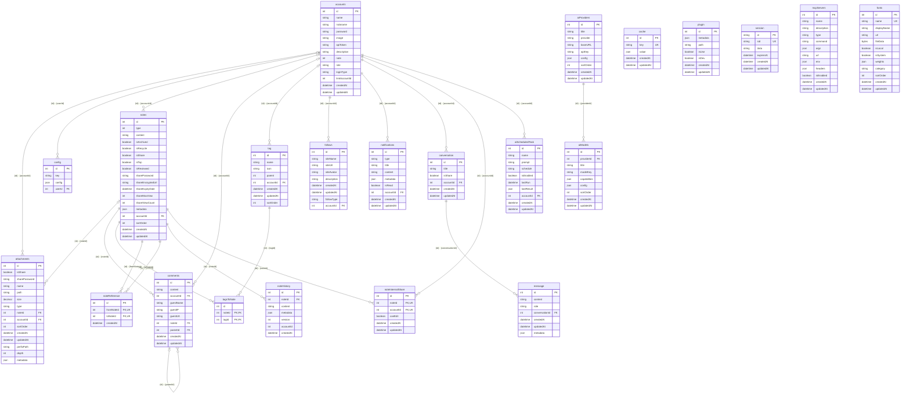

```mermaid
erDiagram
    notes |o--o{ attachments : "(id) - (noteId)"
    accounts |o--o{ attachments : "(id) - (accountId)"
    accounts |o--o{ config : "(id) - (userId)"
    accounts |o--o{ notes : "(id) - (accountId)"
    notes ||--o{ comments : "(id) - (noteId)"
    accounts |o--o{ comments : "(id) - (accountId)"
    comments |o--o{ comments : "(id) - (parentId)"
    accounts |o--o{ tag : "(id) - (accountId)"
    notes ||--o{ tagsToNote : "(id) - (noteId)"
    tag ||--o{ tagsToNote : "(id) - (tagId)"
    notes ||--o{ noteReference : "(id) - (fromNoteId)"
    notes ||--o{ noteReference : "(id) - (toNoteId)"
    accounts ||--o{ follows : "(id) - (accountId)"
    accounts ||--o{ notifications : "(id) - (accountId)"
    accounts ||--o{ conversation : "(id) - (accountId)"
    conversation ||--o{ message : "(id) - (conversationId)"
    notes ||--o{ noteHistory : "(id) - (noteId)"
    notes ||--o{ noteInternalShare : "(id) - (noteId)"
    accounts ||--o{ noteInternalShare : "(id) - (accountId)"
    aiProviders ||--o{ aiModels : "(id) - (providerId)"
    accounts ||--o{ aiScheduledTask : "(id) - (accountId)"
    accounts {
        int id PK
        string name
        string nickname
        string password
        string image
        string apiToken
        string description
        int note
        string role
        string loginType
        int linkAccountId
        datetime createdAt
        datetime updatedAt
    }
    attachments {
        int id PK
        boolean isShare
        string sharePassword
        string name
        string path
        decimal size
        string type
        int noteId FK
        int accountId FK
        int sortOrder
        datetime createdAt
        datetime updatedAt
        string perfixPath
        int depth
        json metadata
    }
    config {
        int id PK
        string key
        json config
        int userId FK
    }
    notes {
        int id PK
        int type
        string content
        boolean isArchived
        boolean isRecycle
        boolean isShare
        boolean isTop
        boolean isReviewed
        string sharePassword
        string shareEncryptedUrl
        datetime shareExpiryDate
        int shareMaxView
        int shareViewCount
        json metadata
        int accountId FK
        int sortOrder
        datetime createdAt
        datetime updatedAt
    }
    comments {
        int id PK
        string content
        int accountId FK
        string guestName
        string guestIP
        string guestUA
        int noteId FK
        int parentId FK
        datetime createdAt
        datetime updatedAt
    }
    tag {
        int id PK
        string name
        string icon
        int parent
        int accountId FK
        datetime createdAt
        datetime updatedAt
        int sortOrder
    }
    tagsToNote {
        int id
        int noteId PK, FK
        int tagId PK, FK
    }
    noteReference {
        int id PK
        int fromNoteId FK, UK
        int toNoteId FK, UK
        datetime createdAt
    }
    follows {
        int id PK
        string siteName
        string siteUrl
        string siteAvatar
        string description
        datetime createdAt
        datetime updatedAt
        string followType
        int accountId FK
    }
    notifications {
        int id PK
        string type
        string title
        string content
        json metadata
        boolean isRead
        int accountId FK
        datetime createdAt
        datetime updatedAt
    }
    cache {
        int id PK
        string key UK
        json value
        datetime createdAt
        datetime updatedAt
    }
    plugin {
        int id PK
        json metadata
        string path
        boolean isUse
        boolean isDev
        datetime createdAt
        datetime updatedAt
    }
    conversation {
        int id PK
        string title
        boolean isShare
        int accountId FK
        datetime createdAt
        datetime updatedAt
    }
    message {
        int id PK
        string content
        string role
        int conversationId FK
        datetime createdAt
        datetime updatedAt
        json metadata
    }
    noteHistory {
        int id PK
        int noteId FK
        string content
        json metadata
        int version
        int accountId
        datetime createdAt
    }
    noteInternalShare {
        int id PK
        int noteId FK, UK
        int accountId FK, UK
        boolean canEdit
        datetime createdAt
        datetime updatedAt
    }
    session {
        string id PK
        string sid UK
        string data
        datetime expiresAt
        datetime createdAt
        datetime updatedAt
    }
    aiProviders {
        int id PK
        string title
        string provider
        string baseURL
        string apiKey
        json config
        int sortOrder
        datetime createdAt
        datetime updatedAt
    }
    aiModels {
        int id PK
        int providerId FK
        string title
        string modelKey
        json capabilities
        json config
        int sortOrder
        datetime createdAt
        datetime updatedAt
    }
    aiScheduledTask {
        int id PK
        string name
        string prompt
        string schedule
        boolean isEnabled
        datetime lastRun
        json lastResult
        int accountId FK
        datetime createdAt
        datetime updatedAt
    }
    mcpServers {
        int id PK
        string name
        string description
        string type
        string command
        json args
        string url
        json env
        json headers
        boolean isEnabled
        datetime createdAt
        datetime updatedAt
    }
    fonts {
        int id PK
        string name UK
        string displayName
        string url
        bytes fileData
        boolean isLocal
        boolean isSystem
        json weights
        string category
        int sortOrder
        datetime createdAt
        datetime updatedAt
    }
```