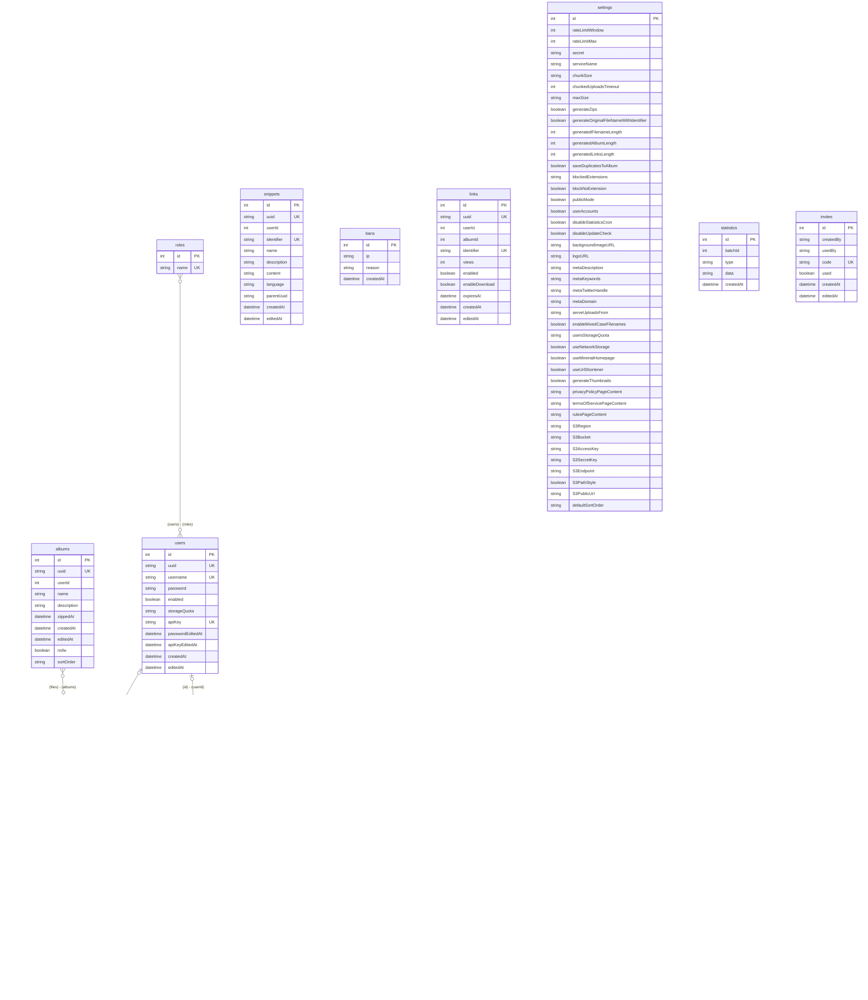

```mermaid
erDiagram
    users |o--o{ files : "(id) - (userId)"
    files ||--o| quarantineFiles : "(uuid) - (fileId)"
    users |o--o{ shortenedLinks : "(id) - (userId)"
    roles }o--o{ users : "(users) - (roles)"
    files }o--o{ tags : "(tags) - (files)"
    albums }o--o{ files : "(files) - (albums)"
    users {
        int id PK
        string uuid UK
        string username UK
        string password
        boolean enabled
        string storageQuota
        string apiKey UK
        datetime passwordEditedAt
        datetime apiKeyEditedAt
        datetime createdAt
        datetime editedAt
    }
    roles {
        int id PK
        string name UK
    }
    files {
        int id PK
        string uuid UK
        int userId FK
        string name
        string original
        string type
        string size
        string hash
        string ip
        string sourceUrl
        boolean isS3
        boolean isWatched
        datetime createdAt
        datetime editedAt
        boolean quarantine
    }
    quarantineFiles {
        string fileId FK, UK
        string name
        string reason
    }
    snippets {
        int id PK
        string uuid UK
        int userId
        string identifier UK
        string name
        string description
        string content
        string language
        string parentUuid
        datetime createdAt
        datetime editedAt
    }
    shortenedLinks {
        int id PK
        string uuid UK
        int userId FK
        string identifier UK
        string destination
        int views
        datetime createdAt
    }
    albums {
        int id PK
        string uuid UK
        int userId
        string name
        string description
        datetime zippedAt
        datetime createdAt
        datetime editedAt
        boolean nsfw
        string sortOrder
    }
    bans {
        int id PK
        string ip
        string reason
        datetime createdAt
    }
    links {
        int id PK
        string uuid UK
        int userId
        int albumId
        string identifier UK
        int views
        boolean enabled
        boolean enableDownload
        datetime expiresAt
        datetime createdAt
        datetime editedAt
    }
    settings {
        int id PK
        int rateLimitWindow
        int rateLimitMax
        string secret
        string serviceName
        string chunkSize
        int chunkedUploadsTimeout
        string maxSize
        boolean generateZips
        boolean generateOriginalFileNameWithIdentifier
        int generatedFilenameLength
        int generatedAlbumLength
        int generatedLinksLength
        boolean saveDuplicatesToAlbum
        string blockedExtensions
        boolean blockNoExtension
        boolean publicMode
        boolean userAccounts
        boolean disableStatisticsCron
        boolean disableUpdateCheck
        string backgroundImageURL
        string logoURL
        string metaDescription
        string metaKeywords
        string metaTwitterHandle
        string metaDomain
        string serveUploadsFrom
        boolean enableMixedCaseFilenames
        string usersStorageQuota
        boolean useNetworkStorage
        boolean useMinimalHomepage
        boolean useUrlShortener
        boolean generateThumbnails
        string privacyPolicyPageContent
        string termsOfServicePageContent
        string rulesPageContent
        string S3Region
        string S3Bucket
        string S3AccessKey
        string S3SecretKey
        string S3Endpoint
        boolean S3PathStyle
        string S3PublicUrl
        string defaultSortOrder
    }
    statistics {
        int id PK
        int batchId
        string type
        string data
        datetime createdAt
    }
    tags {
        int id PK
        string uuid UK
        int userId
        string name
        datetime createdAt
        datetime editedAt
    }
    invites {
        int id PK
        string createdBy
        string usedBy
        string code UK
        boolean used
        datetime createdAt
        datetime editedAt
    }
```