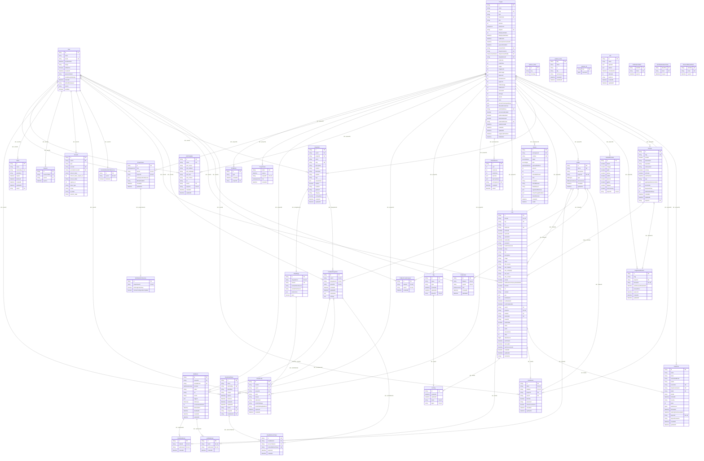

```mermaid
erDiagram
    Project ||--o{ Customer : "(id) - (projectId)"
    Link |o--o{ Customer : "(id) - (linkId)"
    Link |o--o| Dashboard : "(id) - (linkId)"
    Folder |o--o| Dashboard : "(id) - (folderId)"
    Project |o--o{ Dashboard : "(id) - (projectId)"
    User |o--o{ Dashboard : "(id) - (userId)"
    Project |o--o{ Domain : "(id) - (projectId)"
    Project ||--o{ RegisteredDomain : "(id) - (projectId)"
    Domain |o--o| RegisteredDomain : "(id) - (domainId)"
    Project ||--o{ DefaultDomains : "(id) - (projectId)"
    Project ||--o{ Folder : "(id) - (projectId)"
    Folder ||--o{ FolderUser : "(id) - (folderId)"
    User ||--o{ FolderUser : "(id) - (userId)"
    Folder ||--o{ FolderAccessRequest : "(id) - (folderId)"
    User ||--o{ FolderAccessRequest : "(id) - (userId)"
    User |o--o{ Integration : "(id) - (userId)"
    Project ||--o{ Integration : "(id) - (projectId)"
    User ||--o{ InstalledIntegration : "(id) - (userId)"
    Integration ||--o{ InstalledIntegration : "(id) - (integrationId)"
    Project ||--o{ InstalledIntegration : "(id) - (projectId)"
    Project ||--o{ Invoice : "(id) - (workspaceId)"
    User |o--o{ Link : "(id) - (userId)"
    Project |o--o{ Link : "(id) - (projectId)"
    Folder |o--o{ Link : "(id) - (folderId)"
    Domain ||--o{ Link : "(slug) - (domain)"
    Project ||--o{ YearInReview : "(id) - (workspaceId)"
    User ||--o| UserNotificationPreferences : "(id) - (userId)"
    ProjectUsers ||--o| NotificationPreference : "(id) - (projectUserId)"
    Integration |o--o| OAuthApp : "(id) - (integrationId)"
    OAuthApp ||--o{ OAuthCode : "(clientId) - (clientId)"
    User ||--o{ OAuthCode : "(id) - (userId)"
    Project ||--o{ OAuthCode : "(id) - (projectId)"
    RestrictedToken ||--o{ OAuthRefreshToken : "(id) - (accessTokenId)"
    InstalledIntegration ||--o{ OAuthRefreshToken : "(id) - (installationId)"
    User ||--o{ Account : "(id) - (userId)"
    User ||--o{ Session : "(id) - (userId)"
    Project |o--o{ Tag : "(id) - (projectId)"
    Link ||--o{ LinkTag : "(id) - (linkId)"
    Tag ||--o{ LinkTag : "(id) - (tagId)"
    User ||--o{ Token : "(id) - (userId)"
    User ||--o{ RestrictedToken : "(id) - (userId)"
    Project ||--o{ RestrictedToken : "(id) - (projectId)"
    InstalledIntegration |o--o{ RestrictedToken : "(id) - (installationId)"
    User |o--o{ UtmTemplate : "(id) - (userId)"
    Project |o--o{ UtmTemplate : "(id) - (projectId)"
    Project ||--o{ Webhook : "(id) - (projectId)"
    InstalledIntegration |o--o{ Webhook : "(id) - (installationId)"
    Link ||--o{ LinkWebhook : "(id) - (linkId)"
    Webhook ||--o{ LinkWebhook : "(id) - (webhookId)"
    Folder ||--o{ FolderWebhook : "(id) - (folderId)"
    Webhook ||--o{ FolderWebhook : "(id) - (webhookId)"
    Project ||--o{ ProjectInvite : "(id) - (projectId)"
    User ||--o{ ProjectUsers : "(id) - (userId)"
    Project ||--o{ ProjectUsers : "(id) - (projectId)"
    Project |o--o{ SentEmail : "(id) - (projectId)"
    Customer {
        string id PK
        string name
        string email
        string normalizedEmail
        string avatar
        string externalId UK
        string stripeCustomerId UK
        string linkId FK
        string clickId
        datetime clickedAt
        string country
        int sales
        bigint saleAmount
        datetime firstSaleAt
        datetime subscriptionCanceledAt
        string projectId FK, UK
        string projectConnectId
        datetime createdAt
        datetime updatedAt
    }
    Dashboard {
        string id PK
        string linkId FK, UK
        string folderId FK, UK
        string projectId FK
        string userId FK
        boolean doIndex
        string password
        boolean showConversions
        datetime createdAt
        datetime updatedAt
    }
    Domain {
        string id PK
        string slug UK
        boolean verified
        string placeholder
        string expiredUrl
        string notFoundUrl
        boolean primary
        boolean archived
        datetime lastChecked
        string logo
        json appleAppSiteAssociation
        json assetLinks
        json deepviewData
        int linkRetentionDays
        datetime createdAt
        datetime updatedAt
        string projectId FK
    }
    RegisteredDomain {
        string id PK
        string slug
        string projectId FK
        string domainId FK, UK
        datetime autoRenewalDisabledAt
        int renewalFee
        datetime expiresAt
        datetime createdAt
        datetime updatedAt
    }
    DefaultDomains {
        string id PK
        boolean dubsh
        boolean chatgpt
        boolean sptifi
        boolean gitnew
        boolean callink
        boolean amznid
        boolean ggllink
        boolean figpage
        boolean loooooooong
        string projectId FK, UK
    }
    Folder {
        string id PK
        string name UK
        string description
        string projectId FK, UK
        foldertype type
        folderaccesslevel accessLevel
        datetime createdAt
        datetime updatedAt
    }
    FolderUser {
        string id PK
        string folderId FK, UK
        string userId FK, UK
        folderuserrole role
        datetime createdAt
        datetime updatedAt
    }
    FolderAccessRequest {
        string id PK
        string folderId FK, UK
        string userId FK, UK
        datetime createdAt
    }
    Integration {
        string id PK
        string userId FK
        string projectId FK
        string name
        string slug UK
        string description
        string readme
        string developer
        string website
        string logo
        json screenshots
        boolean verified
        string installUrl
        string guideUrl
        string category
        boolean comingSoon
        datetime createdAt
        datetime updatedAt
    }
    InstalledIntegration {
        string id PK
        string userId FK, UK
        string integrationId FK, UK
        string projectId FK, UK
        datetime createdAt
        datetime updatedAt
        json credentials
        json settings
    }
    Invoice {
        string id PK
        string workspaceId FK
        string number UK
        invoicestatus status
        invoicetype type
        paymentmethod paymentMethod
        int amount
        int fee
        int refundedAmount
        int total
        string receiptUrl
        string refundReason
        string failedReason
        json registeredDomains
        json stripeChargeMetadata
        int failedAttempts
        datetime createdAt
        datetime paidAt
    }
    jackson_index {
        int id PK
        string key
        string storeKey
    }
    jackson_store {
        string key PK
        string value
        string iv
        string tag
        string namespace
        datetime createdAt
        datetime modifiedAt
    }
    jackson_ttl {
        string key PK
        bigint expiresAt
    }
    Job {
        string id PK
        string name
        json payload
        json options
        datetime scheduledAt
        int attempts
        string lastError
        datetime createdAt
        datetime updatedAt
    }
    Link {
        string id PK
        string domain FK, UK
        string key UK
        string url
        string shortLink UK
        boolean archived
        datetime expiresAt
        string expiredUrl
        datetime disabledAt
        string password
        boolean trackConversion
        boolean proxy
        string title
        string description
        string image
        string video
        string utm_source
        string utm_medium
        string utm_campaign
        string utm_term
        string utm_content
        boolean rewrite
        datetime linkRetentionCleanupDisabledAt
        boolean doIndex
        string ios
        string android
        json geo
        json testVariants
        datetime testStartedAt
        datetime testCompletedAt
        string userId FK
        string projectId FK, UK
        string folderId FK
        string externalId UK
        string tenantId
        boolean publicStats
        int clicks
        int leads
        int conversions
        int sales
        bigint saleAmount
        datetime lastClicked
        datetime lastLeadAt
        datetime lastConversionAt
        datetime createdAt
        datetime updatedAt
        string comments
    }
    YearInReview {
        string id PK
        int year
        int totalLinks
        int totalClicks
        json topLinks
        json topCountries
        string workspaceId FK
        datetime createdAt
        datetime sentAt
    }
    UserNotificationPreferences {
        string id PK
        string userId FK, UK
        boolean dubLinks
    }
    NotificationPreference {
        string id PK
        string projectUserId FK, UK
        boolean linkUsageSummary
        boolean domainConfigurationUpdates
    }
    OAuthApp {
        string id PK
        string integrationId FK, UK
        string clientId UK
        string hashedClientSecret
        string partialClientSecret
        json redirectUris
        boolean pkce
    }
    OAuthCode {
        string id PK
        string clientId FK
        string userId FK
        string projectId FK
        string code UK
        string scopes
        string redirectUri
        string codeChallenge
        string codeChallengeMethod
        datetime expiresAt
        datetime createdAt
    }
    OAuthRefreshToken {
        string id PK
        string installationId FK
        string accessTokenId FK
        string hashedRefreshToken UK
        datetime expiresAt
        datetime createdAt
    }
    User {
        string id PK
        string name
        string email UK
        datetime emailVerified
        string image
        boolean isMachine
        datetime createdAt
        string passwordHash
        int invalidLoginAttempts
        datetime lockedAt
        string defaultWorkspace
        string source
        boolean sentMail
    }
    Account {
        string id PK
        string userId FK
        string type
        string provider UK
        string providerAccountId UK
        string refresh_token
        int refresh_token_expires_in
        string access_token
        int expires_at
        string token_type
        string scope
        string id_token
        string session_state
    }
    Session {
        string id PK
        string sessionToken UK
        string userId FK
        datetime expires
    }
    Tag {
        string id PK
        string name UK
        string color
        datetime createdAt
        datetime updatedAt
        string projectId FK, UK
    }
    LinkTag {
        string id PK
        datetime createdAt
        datetime updatedAt
        string linkId FK, UK
        string tagId FK, UK
    }
    Token {
        string id PK
        string name
        string hashedKey UK
        string partialKey
        datetime expires
        datetime lastUsed
        datetime createdAt
        datetime updatedAt
        string userId FK
    }
    RestrictedToken {
        string id PK
        string name
        string hashedKey UK
        string partialKey
        string scopes
        datetime expires
        datetime lastUsed
        datetime createdAt
        datetime updatedAt
        string userId FK
        string projectId FK
        string installationId FK
    }
    VerificationToken {
        string identifier UK
        string token UK
        datetime expires
    }
    EmailVerificationToken {
        string identifier UK
        string token UK
        datetime expires
    }
    PasswordResetToken {
        string identifier UK
        string token UK
        datetime expires
    }
    UtmTemplate {
        string id PK
        string name UK
        string utm_source
        string utm_medium
        string utm_campaign
        string utm_term
        string utm_content
        string ref
        string userId FK
        string projectId FK, UK
        datetime createdAt
        datetime updatedAt
    }
    Webhook {
        string id PK
        string projectId FK
        string installationId FK
        webhookreceiver receiver
        string name
        string url
        string secret
        json triggers
        linkscope linkScope
        int consecutiveFailures
        datetime lastFailedAt
        datetime disabledAt
        datetime createdAt
        datetime updatedAt
    }
    LinkWebhook {
        string id PK
        string linkId FK, UK
        string webhookId FK, UK
        datetime createdAt
    }
    FolderWebhook {
        string id PK
        string folderId FK, UK
        string webhookId FK, UK
        datetime createdAt
    }
    Project {
        string id PK
        string name
        string slug UK
        string logo
        string inviteCode UK
        string plan
        int planTier
        planperiod planPeriod
        string stripeId UK
        int billingCycleStart
        datetime billingCycleEndsAt
        datetime trialEndsAt
        datetime subscriptionCanceledAt
        datetime paymentFailedAt
        string invoicePrefix UK
        string stripeConnectId UK
        stripeconnectmode stripeConnectMode UK
        string shopifyStoreId UK
        int totalLinks
        int totalClicks
        int usage
        int usageLimit
        int linksUsage
        int linksLimit
        int domainsLimit
        int tagsLimit
        int foldersUsage
        int foldersLimit
        int usersLimit
        int aiUsage
        int aiLimit
        json store
        json siteVisitTrackingSettings
        json allowedHostnames
        string publishableKey UK
        boolean conversionEnabled
        boolean webhookEnabled
        boolean dotLinkClaimed
        string ssoEmailDomain UK
        datetime ssoEnforcedAt
        datetime createdAt
        datetime updatedAt
        datetime usageLastChecked
        datetime disabledAt
    }
    ProjectInvite {
        string email UK
        datetime expires
        string projectId FK, UK
        workspacerole role
        datetime createdAt
    }
    ProjectUsers {
        string id PK
        workspacerole role
        string userId FK, UK
        string projectId FK, UK
        json workspacePreferences
        string defaultFolderId
        datetime createdAt
        datetime updatedAt
    }
    SentEmail {
        string id PK
        string type
        datetime createdAt
        string projectId FK
    }
```