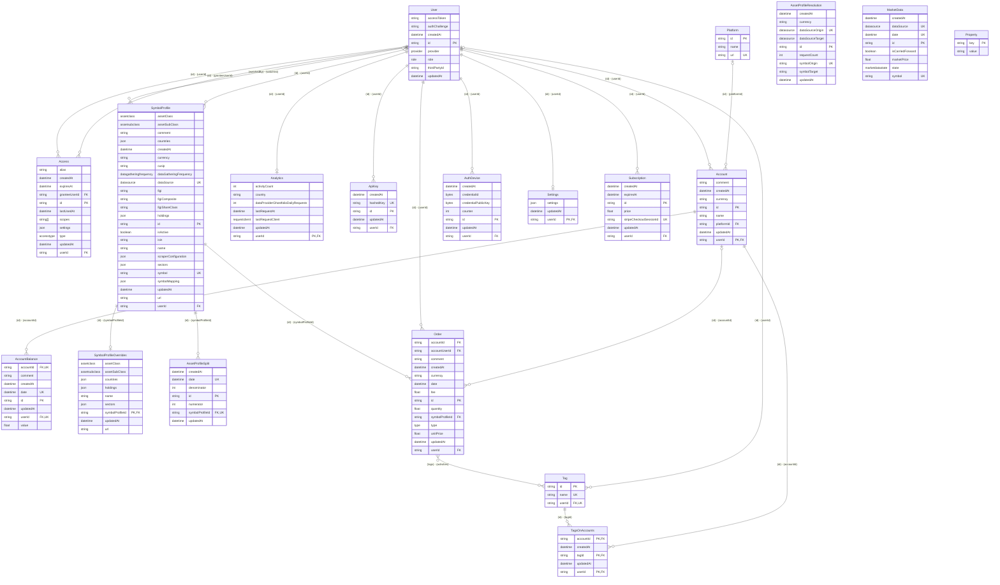

```mermaid
erDiagram
    User |o--o{ Access : "(id) - (granteeUserId)"
    User ||--o{ Access : "(id) - (userId)"
    Platform |o--o{ Account : "(id) - (platformId)"
    User ||--o{ Account : "(id) - (userId)"
    Account ||--o{ AccountBalance : "(id) - (accountId)"
    User ||--o| Analytics : "(id) - (userId)"
    User ||--o{ ApiKey : "(id) - (userId)"
    SymbolProfile ||--o| SymbolProfileOverrides : "(id) - (symbolProfileId)"
    SymbolProfile ||--o{ AssetProfileSplit : "(id) - (symbolProfileId)"
    User ||--o{ AuthDevice : "(id) - (userId)"
    Account |o--o{ Order : "(id) - (accountId)"
    User ||--o{ Order : "(id) - (userId)"
    SymbolProfile ||--o{ Order : "(id) - (symbolProfileId)"
    User ||--o| Settings : "(id) - (userId)"
    User |o--o{ SymbolProfile : "(id) - (userId)"
    User ||--o{ Subscription : "(id) - (userId)"
    User |o--o{ Tag : "(id) - (userId)"
    Account ||--o{ TagsOnAccounts : "(id) - (accountId)"
    Tag ||--o{ TagsOnAccounts : "(id) - (tagId)"
    Order }o--o{ Tag : "(tags) - (activities)"
    SymbolProfile }o--o{ User : "(watchedBy) - (watchlist)"
    Access {
        string alias
        datetime createdAt
        datetime expiresAt
        string granteeUserId FK
        string id PK
        datetime lastUsedAt
        string[] scopes
        json settings
        accesstype type
        datetime updatedAt
        string userId FK
    }
    Account {
        string comment
        datetime createdAt
        string currency
        string id PK
        string name
        string platformId FK
        datetime updatedAt
        string userId PK, FK
    }
    AccountBalance {
        string accountId FK, UK
        string comment
        datetime createdAt
        datetime date UK
        string id PK
        datetime updatedAt
        string userId FK, UK
        float value
    }
    Analytics {
        int activityCount
        string country
        int dataProviderGhostfolioDailyRequests
        datetime lastRequestAt
        requestclient lastRequestClient
        datetime updatedAt
        string userId PK, FK
    }
    ApiKey {
        datetime createdAt
        string hashedKey UK
        string id PK
        datetime updatedAt
        string userId FK
    }
    SymbolProfileOverrides {
        assetclass assetClass
        assetsubclass assetSubClass
        json countries
        json holdings
        string name
        json sectors
        string symbolProfileId PK, FK
        datetime updatedAt
        string url
    }
    AssetProfileResolution {
        datetime createdAt
        string currency
        datasource dataSourceOrigin UK
        datasource dataSourceTarget
        string id PK
        int requestCount
        string symbolOrigin UK
        string symbolTarget
        datetime updatedAt
    }
    AssetProfileSplit {
        datetime createdAt
        datetime date UK
        int denominator
        string id PK
        int numerator
        string symbolProfileId FK, UK
        datetime updatedAt
    }
    AuthDevice {
        datetime createdAt
        bytes credentialId
        bytes credentialPublicKey
        int counter
        string id PK
        datetime updatedAt
        string userId FK
    }
    MarketData {
        datetime createdAt
        datasource dataSource UK
        datetime date UK
        string id PK
        boolean isCarriedForward
        float marketPrice
        marketdatastate state
        string symbol UK
    }
    Order {
        string accountId FK
        string accountUserId FK
        string comment
        datetime createdAt
        string currency
        datetime date
        float fee
        string id PK
        float quantity
        string symbolProfileId FK
        type type
        float unitPrice
        datetime updatedAt
        string userId FK
    }
    Platform {
        string id PK
        string name
        string url UK
    }
    Property {
        string key PK
        string value
    }
    Settings {
        json settings
        datetime updatedAt
        string userId PK, FK
    }
    SymbolProfile {
        assetclass assetClass
        assetsubclass assetSubClass
        string comment
        json countries
        datetime createdAt
        string currency
        string cusip
        datagatheringfrequency dataGatheringFrequency
        datasource dataSource UK
        string figi
        string figiComposite
        string figiShareClass
        json holdings
        string id PK
        boolean isActive
        string isin
        string name
        json scraperConfiguration
        json sectors
        string symbol UK
        json symbolMapping
        datetime updatedAt
        string url
        string userId FK
    }
    Subscription {
        datetime createdAt
        datetime expiresAt
        string id PK
        float price
        string stripeCheckoutSessionId UK
        datetime updatedAt
        string userId FK
    }
    Tag {
        string id PK
        string name UK
        string userId FK, UK
    }
    TagsOnAccounts {
        string accountId PK, FK
        datetime createdAt
        string tagId PK, FK
        datetime updatedAt
        string userId PK, FK
    }
    User {
        string accessToken
        string authChallenge
        datetime createdAt
        string id PK
        provider provider
        role role
        string thirdPartyId
        datetime updatedAt
    }
```