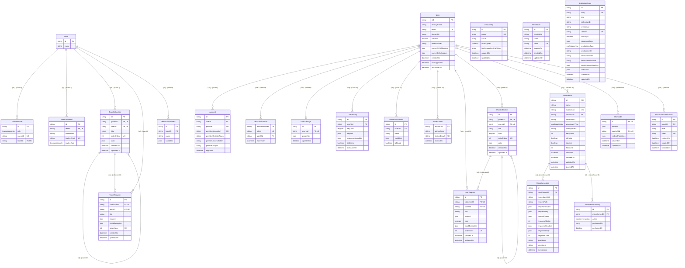

```mermaid
erDiagram
    Team ||--o{ TeamMember : "(id) - (teamID)"
    Team ||--o{ TeamInvitation : "(id) - (teamID)"
    TeamCollection |o--o{ TeamCollection : "(id) - (parentID)"
    Team ||--o{ TeamCollection : "(id) - (teamID)"
    TeamCollection ||--o{ TeamRequest : "(id) - (collectionID)"
    Team ||--o{ TeamRequest : "(id) - (teamID)"
    Team ||--o{ TeamEnvironment : "(id) - (teamID)"
    User ||--o{ Account : "(uid) - (userId)"
    User ||--o{ VerificationToken : "(uid) - (userUid)"
    User ||--o| UserSettings : "(uid) - (userUid)"
    User ||--o{ UserHistory : "(uid) - (userUid)"
    User ||--o{ UserEnvironment : "(uid) - (userUid)"
    User ||--o{ InvitedUsers : "(uid) - (adminUid)"
    UserCollection ||--o{ UserRequest : "(id) - (collectionID)"
    User ||--o{ UserRequest : "(uid) - (userUid)"
    UserCollection |o--o{ UserCollection : "(id) - (parentID)"
    User ||--o{ UserCollection : "(uid) - (userUid)"
    User |o--o{ MockServer : "(uid) - (creatorUid)"
    MockServer ||--o{ MockServerLog : "(id) - (mockServerID)"
    MockServer ||--o{ MockServerActivity : "(id) - (mockServerID)"
    User |o--o{ Shortcode : "(uid) - (creatorUid)"
    User ||--o{ PersonalAccessToken : "(uid) - (userUid)"
    Team {
        string id PK
        string name
    }
    TeamMember {
        string id PK
        teamaccessrole role
        string userUid UK
        string teamID FK, UK
    }
    TeamInvitation {
        string id PK
        string teamID FK, UK
        string creatorUid
        string inviteeEmail UK
        teamaccessrole inviteeRole
    }
    TeamCollection {
        string id PK
        string parentID FK, UK
        string teamID FK, UK
        string title
        int orderIndex UK
        json data
        datetime createdOn
        datetime updatedOn
    }
    TeamRequest {
        string id PK
        string collectionID FK, UK
        string teamID FK, UK
        string title
        json request
        json mockExamples
        int orderIndex UK
        datetime createdOn
        datetime updatedOn
    }
    TeamEnvironment {
        string id PK
        string teamID FK
        string name
        json variables
    }
    User {
        string uid PK
        string displayName
        string email UK
        string photoURL
        boolean isAdmin
        string refreshToken
        json currentRESTSession
        json currentGQLSession
        datetime createdOn
        datetime lastLoggedOn
        datetime lastActiveOn
    }
    Account {
        string id PK
        string userId FK
        string provider UK
        string providerAccountId UK
        string providerRefreshToken
        string providerAccessToken
        string providerScope
        datetime loggedIn
    }
    VerificationToken {
        string deviceIdentifier UK
        string token UK
        string userUid FK
        datetime expiresOn
    }
    UserSettings {
        string id PK
        string userUid FK, UK
        json properties
        datetime updatedOn
    }
    UserHistory {
        string id PK
        string userUid FK
        reqtype reqType
        json request
        json responseMetadata
        boolean isStarred
        datetime executedOn
    }
    UserEnvironment {
        string id PK
        string userUid FK
        string name
        json variables
        boolean isGlobal
    }
    InvitedUsers {
        string adminUid FK
        string adminEmail
        string inviteeEmail UK
        datetime invitedOn
    }
    UserRequest {
        string id PK
        string collectionID FK, UK
        string userUid FK, UK
        string title
        json request
        reqtype type
        json mockExamples
        int orderIndex UK
        datetime createdOn
        datetime updatedOn
    }
    UserCollection {
        string id PK
        string parentID FK, UK
        string userUid FK, UK
        string title
        reqtype type
        int orderIndex UK
        json data
        datetime createdOn
        datetime updatedOn
    }
    MockServer {
        string id PK
        string name
        string subdomain UK
        string creatorUid FK
        string collectionID
        workspacetype workspaceType
        string workspaceID
        int delayInMs
        boolean isPublic
        boolean isActive
        int hitCount
        datetime lastHitAt
        datetime createdOn
        datetime updatedOn
        datetime deletedAt
    }
    MockServerLog {
        string id PK
        string mockServerID FK
        string requestMethod
        string requestPath
        json requestHeaders
        json requestBody
        json requestQuery
        int responseStatus
        json responseHeaders
        json responseBody
        int responseTime
        string ipAddress
        string userAgent
        datetime executedAt
    }
    MockServerActivity {
        string id PK
        string mockServerID FK
        mockserveraction action
        string performedBy
        datetime performedAt
    }
    Shortcode {
        string id PK, UK
        json request
        string creatorUid FK, UK
        json embedProperties
        datetime createdOn
        datetime updatedOn
    }
    InfraConfig {
        string id PK
        string name UK
        string value
        boolean isEncrypted
        string lastSyncedEnvFileValue
        datetime createdOn
        datetime updatedOn
    }
    PersonalAccessToken {
        string id PK
        string userUid FK
        string label
        string token UK
        datetime expiresOn
        datetime createdOn
        datetime updatedOn
    }
    InfraToken {
        string id PK
        string creatorUid
        string label
        string token UK
        datetime expiresOn
        datetime createdOn
        datetime updatedOn
    }
    PublishedDocs {
        string id PK
        string slug UK
        string title
        string collectionID
        string creatorUid
        string version UK
        boolean autoSync
        json documentTree
        workspacetype workspaceType
        string workspaceID
        string environmentID
        string environmentName
        json environmentVariables
        json metadata
        datetime createdOn
        datetime updatedOn
    }
```