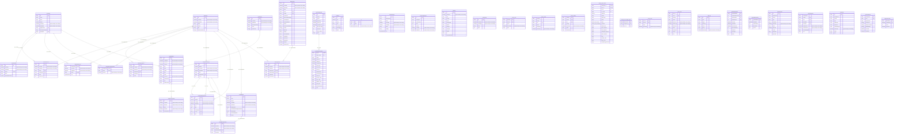

```mermaid
erDiagram
    UserProfile ||--o{ UserPreferences : "(id) - (userId)"
    Workspace |o--o{ UserPreferences : "(id) - (workspaceId)"
    UserProfile ||--o| UserPassword : "(id) - (userId)"
    Workspace ||--o{ WorkspaceOptions : "(id) - (workspaceId)"
    Workspace ||--o{ WorkspaceAccess : "(id) - (workspaceId)"
    UserProfile ||--o{ WorkspaceAccess : "(id) - (userId)"
    Workspace ||--o{ WorkspaceUserProperties : "(id) - (workspaceId)"
    UserProfile ||--o{ WorkspaceUserProperties : "(id) - (userId)"
    UserProfile ||--o{ UserApiToken : "(id) - (userId)"
    OAuthClient |o--o{ UserApiToken : "(id) - (oauthClientId)"
    UserApiToken ||--o{ OAuthAccessToken : "(id) - (refreshTokenId)"
    Workspace ||--o{ ConfigurationObject : "(id) - (workspaceId)"
    Workspace ||--o{ ConfigurationObjectLink : "(id) - (workspaceId)"
    ConfigurationObject ||--o{ ConfigurationObjectLink : "(id) - (fromId)"
    ConfigurationObject ||--o{ ConfigurationObjectLink : "(id) - (toId)"
    Workspace ||--o{ ProfileBuilder : "(id) - (workspaceId)"
    ConfigurationObject |o--o{ ProfileBuilder : "(id) - (destinationId)"
    ProfileBuilder ||--o{ ProfileBuilderFunction : "(id) - (profileBuilderId)"
    ConfigurationObject ||--o{ ProfileBuilderFunction : "(id) - (functionId)"
    Workspace ||--o{ OidcLoginGroup : "(id) - (workspaceId)"
    OidcProvider ||--o{ OidcLoginGroup : "(id) - (oidcProviderId)"
    reprocessing_jobs ||--o{ reprocessing_workers : "(id) - (job_id)"
    EmailLog {
        string id PK
        datetime time
        json email
        string error
        string previewUrl
        string messageId
        string status
    }
    UserPreferences {
        string id PK
        datetime createdAt "@zod.custom(z.coerce.date())"
        datetime updatedAt "@zod.custom(z.coerce.date())"
        string userId FK
        string workspaceId FK
        string scope
        json preferences
    }
    UserProfile {
        string id PK
        string name
        string email
        boolean admin
        datetime createdAt "@zod.custom(z.coerce.date())"
        datetime updatedAt "@zod.custom(z.coerce.date())"
        string loginProvider UK
        string externalUsername
        string externalId UK
    }
    UserPassword {
        string id PK
        datetime createdAt "@zod.custom(z.coerce.date())"
        datetime updatedAt "@zod.custom(z.coerce.date())"
        string userId FK, UK
        string hash
        boolean changeAtNextLogin
    }
    Workspace {
        string id PK
        datetime createdAt "@zod.custom(z.coerce.date())"
        datetime updatedAt "@zod.custom(z.coerce.date())"
        string name
        boolean deleted
        string slug UK
        string[] featuresEnabled
    }
    WorkspaceOptions {
        string id PK
        datetime createdAt "@zod.custom(z.coerce.date())"
        datetime updatedAt "@zod.custom(z.coerce.date())"
        string workspaceId FK
        string namespace
        json value
    }
    WorkspaceAccess {
        string workspaceId PK, FK
        datetime createdAt "@zod.custom(z.coerce.date())"
        datetime updatedAt "@zod.custom(z.coerce.date())"
        string userId PK, FK
        workspacerole role
    }
    WorkspaceUserProperties {
        string workspaceId PK, FK
        string userId PK, FK
        datetime lastUsed "@zod.custom(z.coerce.date())"
    }
    UserApiToken {
        string id PK
        datetime createdAt "@zod.custom(z.coerce.date())"
        datetime updatedAt "@zod.custom(z.coerce.date())"
        datetime lastUsed "@zod.custom(z.coerce.date())"
        string hint
        string hash
        string userId FK
        string type
        string name
        datetime expiresAt "@zod.custom(z.coerce.date())"
        string workspaceId
        string role
        string oauthClientId FK
    }
    OAuthClient {
        string id PK
        datetime createdAt "@zod.custom(z.coerce.date())"
        datetime updatedAt "@zod.custom(z.coerce.date())"
        string clientSecretHash
        string name
        string[] redirectUris
    }
    kv {
        string key PK
        json value
        datetime expiresAt "@zod.custom(z.coerce.date())"
    }
    OAuthAccessToken {
        string id PK
        datetime createdAt "@zod.custom(z.coerce.date())"
        datetime lastUsed "@zod.custom(z.coerce.date())"
        string hash
        datetime expiresAt "@zod.custom(z.coerce.date())"
        string refreshTokenId FK
    }
    InvitationToken {
        string id PK
        string workspaceId
        string email
        datetime createdAt "@zod.custom(z.coerce.date())"
        datetime updatedAt "@zod.custom(z.coerce.date())"
        string token
        string usedBy
        workspacerole role
    }
    ConfigurationObject {
        string id PK
        boolean deleted
        datetime createdAt "@zod.custom(z.coerce.date())"
        datetime updatedAt "@zod.custom(z.coerce.date())"
        string type
        string workspaceId FK
        json config
    }
    ConfigurationObjectLink {
        string id PK
        boolean deleted
        datetime createdAt "@zod.custom(z.coerce.date())"
        datetime updatedAt "@zod.custom(z.coerce.date())"
        string type
        json data
        string workspaceId FK
        string fromId FK
        string toId FK
    }
    ConnectorPackage {
        string id PK
        string packageId
        string packageType
        json meta
        bytes logoSvg
        datetime createdAt "@zod.custom(z.coerce.date())"
        datetime updatedAt "@zod.custom(z.coerce.date())"
    }
    AuditLog {
        string id PK
        datetime timestamp "@zod.custom(z.coerce.date())"
        string type
        string severity
        string userId
        string workspaceId
        string objectId
        json changes
        string authType
        string tokenId
        string ip
        json requestHeaders
    }
    GlobalProps {
        string id PK
        datetime createdAt "@zod.custom(z.coerce.date())"
        datetime updatedAt "@zod.custom(z.coerce.date())"
        string name
        json value
    }
    source_spec {
        string package PK
        string version PK
        json specs
        datetime timestamp "@zod.custom(z.coerce.date())"
        string error
    }
    source_check {
        string package
        string version
        string key PK
        string status
        string description
        datetime timestamp "@zod.custom(z.coerce.date())"
    }
    source_catalog {
        string package PK
        string version PK
        string key PK
        json catalog
        datetime timestamp "@zod.custom(z.coerce.date())"
        string status
        string description
    }
    reverse_sync_control {
        string workspace_id PK, UK
        string sync_id PK, UK
        string run_id PK
        bigint run_order UK
        boolean detached
        string revision
        string target_hash
        string phase
        reverse_sync_mode mode
        reverse_sync_extraction extraction
        bytes artifact_head
        bigint base_sequence
        bigint next_sequence
        bigint checkpoint_sequence
        bigint finish_sequence
        bytes store
        bytes provider_state
        bytes finish_result
        string committed_generation
    }
    reverse_sync_target_owner {
        string target_hash PK
        string workspace_id UK
        string sync_id UK
    }
    source_state {
        string sync_id PK
        string stream PK
        json state
        datetime timestamp "@zod.custom(z.coerce.date())"
    }
    source_task {
        string sync_id
        string task_id PK
        string package
        string version
        datetime started_at "@zod.custom(z.coerce.date())"
        datetime updated_at "@zod.custom(z.coerce.date())"
        json started_by
        string status
        string description
        json metrics
        string error
    }
    task_log {
        string id PK
        string level
        string logger
        string message
        string sync_id
        string task_id
        datetime timestamp "@zod.custom(z.coerce.date())"
    }
    ProfileBuilder {
        string id PK
        string name
        boolean deleted
        datetime createdAt "@zod.custom(z.coerce.date())"
        datetime updatedAt "@zod.custom(z.coerce.date())"
        string workspaceId FK
        json intermediateStorageCredentials
        string destinationId FK
        json connectionOptions
        int version
    }
    ProfileBuilderFunction {
        string id PK
        datetime createdAt "@zod.custom(z.coerce.date())"
        datetime updatedAt "@zod.custom(z.coerce.date())"
        string profileBuilderId FK
        string functionId FK
    }
    ProfileBuilderState {
        string profileBuilderId PK
        int profileBuilderVersion PK
        int instanceIndex PK
        int totalInstances PK
        datetime startedAt
        datetime updatedAt
        datetime lastTimestamp
        int processedUsers
        int totalUsers
        int errorUsers
        float speed
    }
    ProfileBuilderState2 {
        string profileBuilderId PK
        datetime updatedAt
        json fullRebuildInfo
        json queuesInfo
        json metrics
    }
    StatusChange {
        bigint id PK
        string workspaceId
        string actorId
        string type
        string tableName
        datetime timestamp "@zod.custom(z.coerce.date())"
        string status
        datetime startedAt
        int counts
        string description
        int queueSize
    }
    NotificationState {
        string workspaceId
        string actorId PK
        string type PK
        string tableName PK
        string channelId PK
        datetime flappingSince "@zod.custom(z.coerce.date())"
        datetime lastNotification "@zod.custom(z.coerce.date())"
        bigint statusChangeId
        string error
    }
    Notification {
        string id PK
        string workspaceId
        string actorId
        string type
        string tableName
        string channelId
        bigint statusChangeId
        datetime timestamp "@zod.custom(z.coerce.date())"
        string status
        string error
    }
    OidcProvider {
        string id PK
        datetime createdAt "@zod.custom(z.coerce.date())"
        datetime updatedAt "@zod.custom(z.coerce.date())"
        string name
        string issuer UK
        string clientId UK
        string clientSecret
        string authorizationEndpoint
        string tokenEndpoint
        string userinfoEndpoint
        string jwksUri
        string introspectionEndpoint
        string[] scopes
        string audience
        string prompt
        string usernameClaim
        string emailClaim
        string nameClaim
        string groupClaim
        boolean enabled
        boolean autoDiscovery
    }
    OidcLoginGroup {
        string id PK
        datetime createdAt "@zod.custom(z.coerce.date())"
        datetime updatedAt "@zod.custom(z.coerce.date())"
        string workspaceId FK, UK
        string oidcProviderId FK, UK
        string groupValue
        boolean allowAllUsers
    }
    reprocessing_jobs {
        string id PK
        json config
        string status
        datetime created_at
        datetime started_at
        datetime completed_at
        string k8s_job_name
        int total_files
        int total_workers
        string error
    }
    reprocessing_workers {
        string job_id PK, FK
        int worker_index PK
        string status
        datetime started_at
        datetime updated_at
        datetime completed_at
        string current_file
        bigint current_line
        string current_ts
        int assigned_files
        int processed_files
        bigint total_lines
        bigint success_count
        bigint error_count
        bigint skipped_count
        bigint total_bytes
        bigint processed_bytes
        string error
    }
    FunctionsServer {
        string workspaceId PK
        string class PK
        string deploymentId
        string[] connections
        string[] emptyConnections
        string[] profileBuilders
        datetime createdAt
        datetime updatedAt
    }
    RateLimitCounter {
        string bucketKey PK
        datetime windowStart PK
        int count
        datetime expiresAt
    }
```