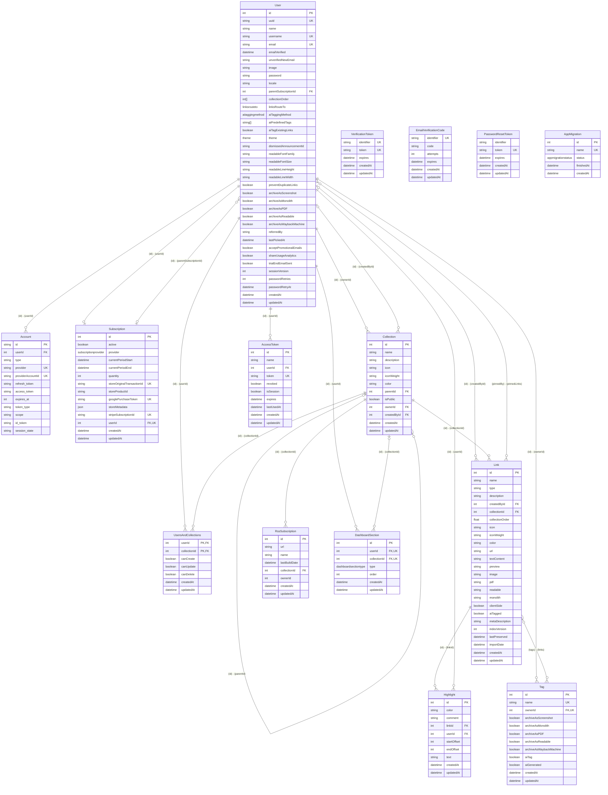

```mermaid
erDiagram
    User ||--o{ Account : "(id) - (userId)"
    Subscription |o--o{ User : "(id) - (parentSubscriptionId)"
    Collection |o--o{ Collection : "(id) - (parentId)"
    User ||--o{ Collection : "(id) - (ownerId)"
    User |o--o{ Collection : "(id) - (createdById)"
    User ||--o{ UsersAndCollections : "(id) - (userId)"
    Collection ||--o{ UsersAndCollections : "(id) - (collectionId)"
    User |o--o{ Link : "(id) - (createdById)"
    Collection ||--o{ Link : "(id) - (collectionId)"
    User ||--o{ Tag : "(id) - (ownerId)"
    User ||--o| Subscription : "(id) - (userId)"
    User ||--o{ AccessToken : "(id) - (userId)"
    Collection ||--o{ RssSubscription : "(id) - (collectionId)"
    Link ||--o{ Highlight : "(id) - (linkId)"
    User ||--o{ Highlight : "(id) - (userId)"
    User ||--o{ DashboardSection : "(id) - (userId)"
    Collection |o--o{ DashboardSection : "(id) - (collectionId)"
    Link }o--o{ User : "(pinnedBy) - (pinnedLinks)"
    Link }o--o{ Tag : "(tags) - (links)"
    Account {
        string id PK
        int userId FK
        string type
        string provider UK
        string providerAccountId UK
        string refresh_token
        string access_token
        int expires_at
        string token_type
        string scope
        string id_token
        string session_state
    }
    User {
        int id PK
        string uuid UK
        string name
        string username UK
        string email UK
        datetime emailVerified
        string unverifiedNewEmail
        string image
        string password
        string locale
        int parentSubscriptionId FK
        int[] collectionOrder
        linksrouteto linksRouteTo
        aitaggingmethod aiTaggingMethod
        string[] aiPredefinedTags
        boolean aiTagExistingLinks
        theme theme
        string dismissedAnnouncementId
        string readableFontFamily
        string readableFontSize
        string readableLineHeight
        string readableLineWidth
        boolean preventDuplicateLinks
        boolean archiveAsScreenshot
        boolean archiveAsMonolith
        boolean archiveAsPDF
        boolean archiveAsReadable
        boolean archiveAsWaybackMachine
        string referredBy
        datetime lastPickedAt
        boolean acceptPromotionalEmails
        boolean shareUsageAnalytics
        boolean trialEndEmailSent
        int sessionVersion
        int passwordRetries
        datetime passwordRetryAt
        datetime createdAt
        datetime updatedAt
    }
    VerificationToken {
        string identifier UK
        string token UK
        datetime expires
        datetime createdAt
        datetime updatedAt
    }
    EmailVerificationCode {
        string identifier UK
        string code
        int attempts
        datetime expires
        datetime createdAt
        datetime updatedAt
    }
    PasswordResetToken {
        string identifier
        string token UK
        datetime expires
        datetime createdAt
        datetime updatedAt
    }
    Collection {
        int id PK
        string name
        string description
        string icon
        string iconWeight
        string color
        int parentId FK
        boolean isPublic
        int ownerId FK
        int createdById FK
        datetime createdAt
        datetime updatedAt
    }
    UsersAndCollections {
        int userId PK, FK
        int collectionId PK, FK
        boolean canCreate
        boolean canUpdate
        boolean canDelete
        datetime createdAt
        datetime updatedAt
    }
    Link {
        int id PK
        string name
        string type
        string description
        int createdById FK
        int collectionId FK
        float collectionOrder
        string icon
        string iconWeight
        string color
        string url
        string textContent
        string preview
        string image
        string pdf
        string readable
        string monolith
        boolean clientSide
        boolean aiTagged
        string metaDescription
        int indexVersion
        datetime lastPreserved
        datetime importDate
        datetime createdAt
        datetime updatedAt
    }
    Tag {
        int id PK
        string name UK
        int ownerId FK, UK
        boolean archiveAsScreenshot
        boolean archiveAsMonolith
        boolean archiveAsPDF
        boolean archiveAsReadable
        boolean archiveAsWaybackMachine
        boolean aiTag
        boolean aiGenerated
        datetime createdAt
        datetime updatedAt
    }
    Subscription {
        int id PK
        boolean active
        subscriptionprovider provider
        datetime currentPeriodStart
        datetime currentPeriodEnd
        int quantity
        string storeOriginalTransactionId UK
        string storeProductId
        string googlePurchaseToken UK
        json storeMetadata
        string stripeSubscriptionId UK
        int userId FK, UK
        datetime createdAt
        datetime updatedAt
    }
    AccessToken {
        int id PK
        string name
        int userId FK
        string token UK
        boolean revoked
        boolean isSession
        datetime expires
        datetime lastUsedAt
        datetime createdAt
        datetime updatedAt
    }
    RssSubscription {
        int id PK
        string url
        string name
        datetime lastBuildDate
        int collectionId FK
        int ownerId
        datetime createdAt
        datetime updatedAt
    }
    Highlight {
        int id PK
        string color
        string comment
        int linkId FK
        int userId FK
        int startOffset
        int endOffset
        string text
        datetime createdAt
        datetime updatedAt
    }
    DashboardSection {
        int id PK
        int userId FK, UK
        int collectionId FK, UK
        dashboardsectiontype type
        int order
        datetime createdAt
        datetime updatedAt
    }
    AppMigration {
        int id PK
        string name UK
        appmigrationstatus status
        datetime finishedAt
        datetime createdAt
    }
```