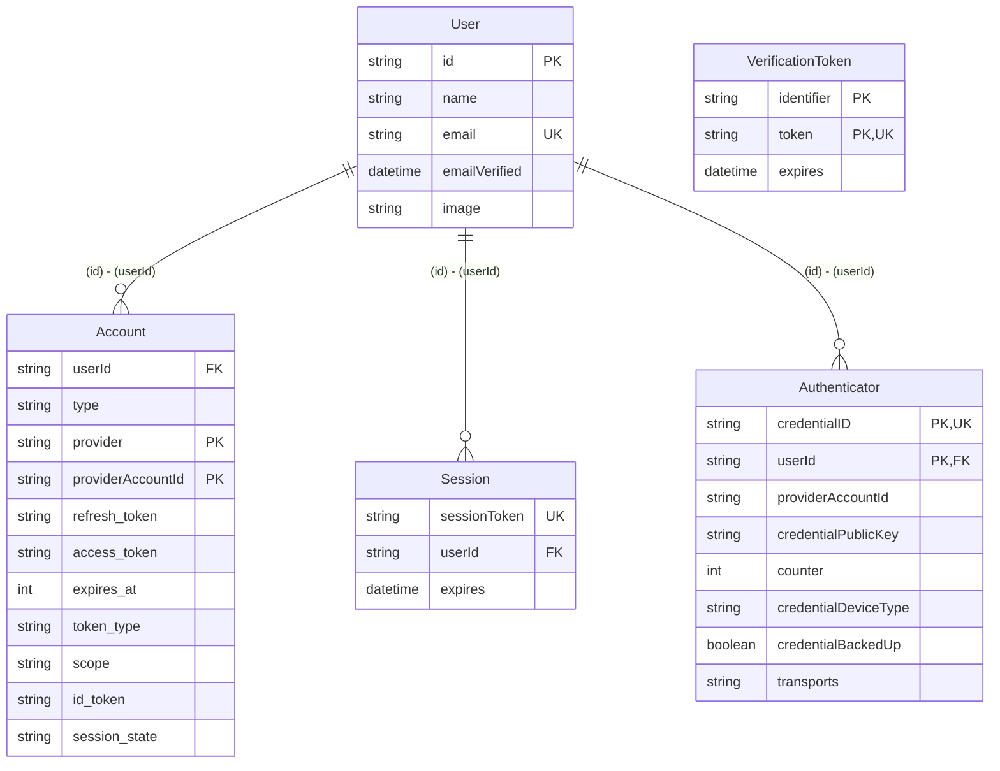

```mermaid
erDiagram
    User ||--o{ Account : "(id) - (userId)"
    User ||--o{ Session : "(id) - (userId)"
    User ||--o{ Authenticator : "(id) - (userId)"
    User {
        string id PK
        string name
        string email UK
        datetime emailVerified
        string image
    }
    Account {
        string userId FK
        string type
        string provider PK
        string providerAccountId PK
        string refresh_token
        string access_token
        int expires_at
        string token_type
        string scope
        string id_token
        string session_state
    }
    Session {
        string sessionToken UK
        string userId FK
        datetime expires
    }
    VerificationToken {
        string identifier PK
        string token PK, UK
        datetime expires
    }
    Authenticator {
        string credentialID PK, UK
        string userId PK, FK
        string providerAccountId
        string credentialPublicKey
        int counter
        string credentialDeviceType
        boolean credentialBackedUp
        string transports
    }
```