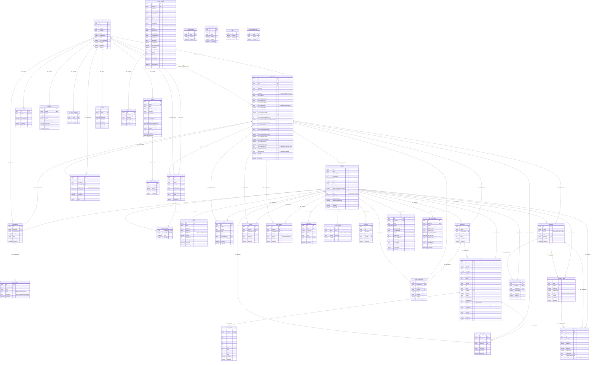

```mermaid
erDiagram
    projects ||--o{ conversations : "(id) - (projectId)"
    organizations ||--o{ conversations : "(id) - (organizationId)"
    users ||--o{ conversations : "(id) - (userId)"
    conversations ||--o{ chat_messages : "(id) - (conversationId)"
    users |o--o{ organizations : "(id) - (createdByUserId)"
    users |o--o{ organizations : "(id) - (subscriptionCreatedByUserId)"
    users ||--o| user_totp : "(id) - (userId)"
    users ||--o| two_factor : "(id) - (userId)"
    users ||--o{ two_factor_challenges : "(id) - (userId)"
    users ||--o{ accounts : "(id) - (userId)"
    users ||--o{ sessions : "(id) - (userId)"
    users |o--o{ members : "(id) - (userId)"
    users |o--o{ members : "(id) - (invitedById)"
    organizations ||--o{ members : "(id) - (organizationId)"
    members ||--o{ member_projects : "(id) - (memberId)"
    projects ||--o{ member_projects : "(id) - (projectId)"
    users ||--o{ invites : "(id) - (createdById)"
    organizations ||--o{ invites : "(id) - (organizationId)"
    organizations ||--o{ projects : "(id) - (organizationId)"
    projects ||--o{ cohorts : "(id) - (projectId)"
    projects |o--o{ clients : "(id) - (projectId)"
    organizations ||--o{ clients : "(id) - (organizationId)"
    organizations ||--o{ dashboards : "(id) - (organizationId)"
    projects ||--o{ dashboards : "(id) - (projectId)"
    projects ||--o{ reports : "(id) - (projectId)"
    dashboards ||--o{ reports : "(id) - (dashboardId)"
    reports ||--o| report_layouts : "(id) - (reportId)"
    projects ||--o| shares : "(id) - (projectId)"
    organizations ||--o{ shares : "(id) - (organizationId)"
    dashboards ||--o| share_dashboards : "(id) - (dashboardId)"
    organizations ||--o{ share_dashboards : "(id) - (organizationId)"
    projects ||--o{ share_dashboards : "(id) - (projectId)"
    reports ||--o| share_reports : "(id) - (reportId)"
    organizations ||--o{ share_reports : "(id) - (organizationId)"
    projects ||--o{ share_reports : "(id) - (projectId)"
    projects ||--o{ share_widgets : "(id) - (projectId)"
    organizations ||--o{ share_widgets : "(id) - (organizationId)"
    projects ||--o{ event_meta : "(id) - (projectId)"
    projects ||--o{ custom_events : "(id) - (projectId)"
    projects ||--o{ references : "(id) - (projectId)"
    projects ||--o{ notification_rules : "(id) - (projectId)"
    projects ||--o{ notifications : "(id) - (projectId)"
    integrations |o--o{ notifications : "(id) - (integrationId)"
    notification_rules |o--o{ notifications : "(id) - (notificationRuleId)"
    organizations ||--o{ integrations : "(id) - (organizationId)"
    projects |o--o{ integrations : "(id) - (projectId)"
    projects ||--o{ export_watermarks : "(id) - (projectId)"
    integrations ||--o{ export_watermarks : "(id) - (integrationId)"
    accounts ||--o{ reset_password : "(id) - (accountId)"
    projects ||--o{ imports : "(id) - (projectId)"
    project_insights ||--o{ insight_events : "(id) - (insightId)"
    projects ||--o| gsc_connections : "(id) - (projectId)"
    integrations }o--o{ notification_rules : "(notificationRules) - (integrations)"
    __code_migrations {
        string id PK
        string name UK
        datetime createdAt
        datetime updatedAt
    }
    conversations {
        string id PK
        string projectId FK
        string organizationId FK
        string userId FK
        string title
        datetime createdAt
        datetime updatedAt
    }
    chat_messages {
        string id PK
        string conversationId FK
        string role
        json parts "[IPrismaUIMessageParts]"
        json metadata "[IPrismaChatMessageMetadata]"
        datetime createdAt
    }
    organizations {
        string id PK
        string name
        string slug UK
        string createdByUserId FK
        string timezone
        string onboarding
        json attribution "[IPrismaOrganizationAttribution]"
        string subscriptionId
        string subscriptionCustomerId
        string subscriptionPriceId
        string subscriptionProductId
        string subscriptionStatus "[IPrismaSubscriptionStatus]"
        datetime subscriptionStartsAt
        datetime subscriptionEndsAt
        datetime subscriptionCanceledAt
        string subscriptionCreatedByUserId FK
        int subscriptionPeriodEventsCount
        datetime subscriptionPeriodEventsCountExceededAt
        int subscriptionPeriodEventsLimit
        string subscriptionInterval
        string subscriptionCancelReason "[IPrismaCancellationReason]"
        string subscriptionCancelComment
        datetime subscriptionSaveDiscountAppliedAt
        boolean subscriptionPauseAtPeriodEnd
        datetime subscriptionResumesAt
        datetime subscriptionFirstStartedAt
        datetime usageWarningSentAt
        datetime usageExceededSentAt
        json subscriptionDiscount "[IPrismaSubscriptionDiscount]"
        datetime windDownStartedAt
        string windDownStep "[IPrismaWindDownStep]"
        datetime deleteAt
        datetime createdAt
        datetime updatedAt
    }
    users {
        string id PK
        string email UK
        string firstName
        string lastName
        string name
        boolean emailVerified
        string image
        boolean twoFactorEnabled
        datetime createdAt
        datetime updatedAt
        datetime deletedAt
    }
    user_totp {
        string id PK
        string userId FK, UK
        string secret
        string[] recoveryCodes
        datetime enabledAt
        datetime createdAt
        datetime updatedAt
    }
    two_factor {
        string id PK
        string userId FK, UK
        string secret
        string backupCodes
        boolean verified
        int failedVerificationCount
        datetime lockedUntil
        datetime createdAt
        datetime updatedAt
    }
    two_factor_challenges {
        string id PK
        string userId FK
        datetime expiresAt
        datetime createdAt
    }
    accounts {
        string id PK
        string userId FK
        string email
        string provider
        string providerId
        string accountId
        string idToken
        string accessToken
        string refreshToken
        datetime accessTokenExpiresAt
        datetime refreshTokenExpiresAt
        string scope
        string password
        datetime createdAt
        datetime updatedAt
    }
    sessions {
        string id PK
        string token UK
        string userId FK
        datetime expiresAt
        string ipAddress
        string userAgent
        datetime createdAt
        datetime updatedAt
    }
    verifications {
        string id PK
        string identifier
        string value
        datetime expiresAt
        datetime createdAt
        datetime updatedAt
    }
    members {
        string id PK
        string role
        string email
        string userId FK, UK
        string invitedById FK
        string organizationId FK, UK
        projectscope projectScope
        json meta
        datetime createdAt
        datetime updatedAt
    }
    member_projects {
        string memberId PK, FK
        string projectId PK, FK
        accesslevel level
        datetime createdAt
    }
    invites {
        string id PK
        string email
        string createdById FK
        string organizationId FK
        json projectAccess "[IPrismaInviteProjectAccess]"
        projectscope projectScope
        datetime expiresAt
        datetime createdAt
        datetime updatedAt
        string role
    }
    projects {
        string id PK
        string name
        string organizationId FK
        int eventsCount
        projecttype[] types
        string domain
        string[] cors
        boolean crossDomain
        boolean allowUnsafeRevenueTracking
        boolean aiStoreContent
        json filters "[IPrismaProjectFilters]"
        datetime firstEventAt
        datetime noDataNotifiedAt
        datetime dataStoppedNotifiedAt
        datetime deleteAt
        datetime createdAt
        datetime updatedAt
    }
    cohorts {
        string id PK
        string name
        string description
        string projectId FK
        json definition "[IPrismaCohortDefinition]"
        boolean isStatic
        int profileCount
        datetime lastComputedAt
        datetime createdAt
        datetime updatedAt
    }
    salts {
        string salt PK
        datetime createdAt
        datetime updatedAt
    }
    clients {
        string id PK
        string name
        string secret
        clienttype type
        string projectId FK
        string organizationId FK
        boolean ignoreCorsAndSecret
        datetime createdAt
        datetime updatedAt
    }
    dashboards {
        string id PK
        string name
        string organizationId FK
        string projectId FK
        json filters
        datetime createdAt
        datetime updatedAt
    }
    reports {
        string id PK
        string name
        interval interval
        string range
        charttype chartType
        string lineType
        json breakdowns
        json events
        json globalFilters
        string formula
        string unit
        metric metric
        string projectId FK
        boolean previous
        string criteria
        string funnelGroup
        float funnelWindow
        json options "[IReportOptions]"
        json display "How a dashboard tile shows the report: { view: 'chart' | 'table' }"
        string[] visibleSeries
        string startDate
        string endDate
        string dashboardId FK
        datetime createdAt
        datetime updatedAt
    }
    report_layouts {
        string id PK
        string reportId FK, UK
        int gridColumns
        int x
        int y
        int w
        int h
        int minW
        int minH
        int maxW
        int maxH
        datetime createdAt
        datetime updatedAt
    }
    shares {
        string id UK
        string projectId FK, UK
        string organizationId FK
        boolean public
        string password
        datetime createdAt
        datetime updatedAt
    }
    share_dashboards {
        string id UK
        string dashboardId FK, UK
        string organizationId FK
        string projectId FK
        boolean public
        string password
        datetime createdAt
        datetime updatedAt
    }
    share_reports {
        string id UK
        string reportId FK, UK
        string organizationId FK
        string projectId FK
        boolean public
        string password
        datetime createdAt
        datetime updatedAt
    }
    share_widgets {
        string id UK
        string projectId FK
        string organizationId FK
        boolean public
        json options "[IPrismaWidgetOptions]"
        datetime createdAt
        datetime updatedAt
    }
    event_meta {
        string id PK
        string name UK
        boolean conversion
        string color
        string icon
        string projectId FK, UK
        datetime createdAt
        datetime updatedAt
    }
    custom_events {
        string id PK
        string name UK
        json items "[IPrismaCustomEventItems]"
        string projectId FK, UK
        datetime createdAt
        datetime updatedAt
    }
    references {
        string id PK
        string title
        string description
        datetime date
        string projectId FK
        datetime createdAt
        datetime updatedAt
    }
    notification_rules {
        string id PK
        string name
        string projectId FK
        boolean sendToApp
        boolean sendToEmail
        json config "[IPrismaNotificationRuleConfig]"
        string template
        datetime createdAt
        datetime updatedAt
    }
    notifications {
        string id PK
        string projectId FK
        string title
        string message
        datetime isReadAt
        datetime createdAt
        datetime updatedAt
        boolean sendToApp
        boolean sendToEmail
        string integrationId FK
        string notificationRuleId FK
        json payload "[IPrismaNotificationPayload]"
    }
    integrations {
        string id PK
        string name
        json config "[IPrismaIntegrationConfig]"
        string organizationId FK
        string projectId FK
        datetime createdAt
        datetime updatedAt
    }
    export_watermarks {
        string id PK
        string projectId FK, UK
        string integrationId FK, UK
        datetime lastInsertedAt
        string lastEventId
        datetime createdAt
        datetime updatedAt
    }
    reset_password {
        string id PK
        string accountId FK
        datetime expiresAt
        datetime createdAt
        datetime updatedAt
    }
    imports {
        string id PK
        string projectId FK
        string jobId
        importstatus status
        string statusMessage
        string errorMessage
        json config "[IPrismaImportConfig]"
        int totalEvents
        int processedEvents
        string currentStep
        string currentBatch
        datetime createdAt
        datetime completedAt
        datetime updatedAt
    }
    project_insights {
        string id PK
        string projectId UK
        string moduleKey UK
        string dimensionKey UK
        string windowKind UK
        insightstate state UK
        string title
        string summary
        string displayName
        json payload "[IPrismaProjectInsightPayload]"
        string direction
        float impactScore
        string severityBand
        float relevanceScore
        string aiSummary
        string aiCategory
        boolean emailWorthy
        boolean referenceWorthy
        datetime enrichedAt
        int enrichVersion
        int version
        string threadId
        datetime windowStart
        datetime windowEnd
        datetime firstDetectedAt
        datetime lastUpdatedAt
        datetime lastSeenAt
    }
    insight_events {
        string id PK
        string insightId FK
        string eventKind
        json changeFrom
        json changeTo
        datetime createdAt
    }
    gsc_connections {
        string id PK
        string projectId FK, UK
        string siteUrl
        string accessToken
        string refreshToken
        datetime accessTokenExpiresAt
        datetime lastSyncedAt
        string lastSyncStatus
        string lastSyncError
        string backfillStatus
        datetime createdAt
        datetime updatedAt
    }
    email_unsubscribes {
        string id PK
        string email UK
        string category UK
        datetime createdAt
    }
```