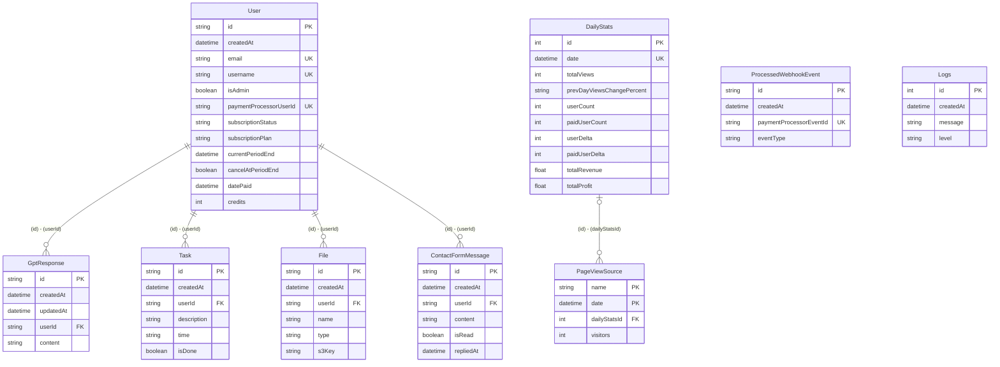

```mermaid
erDiagram
    User ||--o{ GptResponse : "(id) - (userId)"
    User ||--o{ Task : "(id) - (userId)"
    User ||--o{ File : "(id) - (userId)"
    DailyStats |o--o{ PageViewSource : "(id) - (dailyStatsId)"
    User ||--o{ ContactFormMessage : "(id) - (userId)"
    User {
        string id PK
        datetime createdAt
        string email UK
        string username UK
        boolean isAdmin
        string paymentProcessorUserId UK
        string subscriptionStatus
        string subscriptionPlan
        datetime currentPeriodEnd
        boolean cancelAtPeriodEnd
        datetime datePaid
        int credits
    }
    ProcessedWebhookEvent {
        string id PK
        datetime createdAt
        string paymentProcessorEventId UK
        string eventType
    }
    GptResponse {
        string id PK
        datetime createdAt
        datetime updatedAt
        string userId FK
        string content
    }
    Task {
        string id PK
        datetime createdAt
        string userId FK
        string description
        string time
        boolean isDone
    }
    File {
        string id PK
        datetime createdAt
        string userId FK
        string name
        string type
        string s3Key
    }
    DailyStats {
        int id PK
        datetime date UK
        int totalViews
        string prevDayViewsChangePercent
        int userCount
        int paidUserCount
        int userDelta
        int paidUserDelta
        float totalRevenue
        float totalProfit
    }
    PageViewSource {
        string name PK
        datetime date PK
        int dailyStatsId FK
        int visitors
    }
    Logs {
        int id PK
        datetime createdAt
        string message
        string level
    }
    ContactFormMessage {
        string id PK
        datetime createdAt
        string userId FK
        string content
        boolean isRead
        datetime repliedAt
    }
```