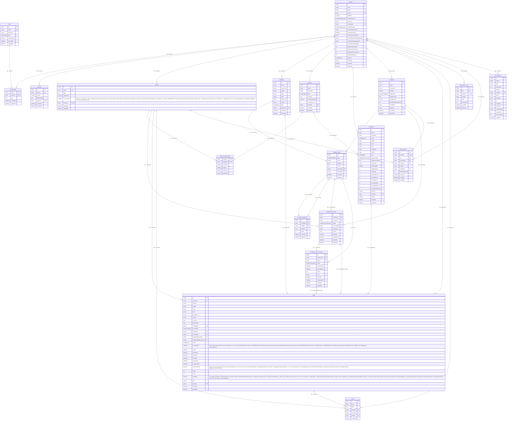

```mermaid
erDiagram
    users ||--o{ memberships : "(id) - (userId)"
    projects ||--o{ memberships : "(id) - (projectId)"
    projects ||--o{ domains : "(id) - (projectId)"
    projects ||--o{ contacts : "(id) - (projectId)"
    projects ||--o{ templates : "(id) - (projectId)"
    projects ||--o{ segments : "(id) - (projectId)"
    contacts ||--o{ segment_memberships : "(id) - (contactId)"
    segments ||--o{ segment_memberships : "(id) - (segmentId)"
    segments |o--o{ campaigns : "(id) - (segmentId)"
    projects ||--o{ campaigns : "(id) - (projectId)"
    projects ||--o{ workflows : "(id) - (projectId)"
    workflows ||--o{ workflow_steps : "(id) - (workflowId)"
    templates |o--o{ workflow_steps : "(id) - (templateId)"
    workflow_steps ||--o{ workflow_transitions : "(id) - (fromStepId)"
    workflow_steps ||--o{ workflow_transitions : "(id) - (toStepId)"
    workflows ||--o{ workflow_executions : "(id) - (workflowId)"
    contacts ||--o{ workflow_executions : "(id) - (contactId)"
    workflow_steps |o--o{ workflow_executions : "(id) - (currentStepId)"
    workflow_executions ||--o{ workflow_step_executions : "(id) - (executionId)"
    workflow_steps ||--o{ workflow_step_executions : "(id) - (stepId)"
    contacts ||--o{ emails : "(id) - (contactId)"
    templates |o--o{ emails : "(id) - (templateId)"
    campaigns |o--o{ emails : "(id) - (campaignId)"
    workflow_executions |o--o{ emails : "(id) - (workflowExecutionId)"
    workflow_step_executions |o--o{ emails : "(id) - (workflowStepExecutionId)"
    projects ||--o{ emails : "(id) - (projectId)"
    projects ||--o{ events : "(id) - (projectId)"
    contacts |o--o{ events : "(id) - (contactId)"
    emails |o--o{ events : "(id) - (emailId)"
    projects ||--o{ idempotency_keys : "(id) - (projectId)"
    projects ||--o{ throttle_claims : "(id) - (projectId)"
    contacts |o--o{ throttle_claims : "(id) - (contactId)"
    workflows |o--o{ throttle_claims : "(id) - (workflowId)"
    projects |o--o{ api_requests : "(id) - (projectId)"
    users {
        string id PK
        string email UK
        string password
        authmethod type
        boolean emailVerified
        datetime createdAt
        datetime updatedAt
    }
    projects {
        string id PK
        string name
        string public UK
        string secret UK
        boolean disabled
        projectdisabledreason disabledReason
        string customer UK
        string subscription UK
        cardverificationstatus cardVerification
        string cardVerificationIntent
        datetime cardVerificationAt
        string cardVerificationSession
        string cardVerificationPaymentMethod
        string cardVerificationFingerprint
        int cardVerificationAttempts
        int billingLimitWorkflows
        int billingLimitCampaigns
        int billingLimitTransactional
        int billingLimitInbound
        trackingmode tracking
        string language
        datetime createdAt
        datetime updatedAt
    }
    memberships {
        string userId PK, FK
        string projectId PK, FK
        role role
        datetime createdAt
        datetime updatedAt
    }
    domains {
        string id PK
        string domain UK
        boolean verified
        json dkimTokens
        string projectId FK, UK
        datetime createdAt
        datetime updatedAt
    }
    contacts {
        string id PK
        string email UK
        json data
        boolean subscribed
        datetime snoozedUntil "When set, `subscribed = false` is temporary rather than permanent: the snooze sweep resubscribes the contact once this passes. Suppression itself is still carried entirely by `subscribed`, so every send path filters snoozed contacts out without knowing this column exists.  Cleared by every other write to `subscribed` — including the bounce and complaint paths, so a suppressed address can never be woken back up."
        string projectId FK, UK
        datetime createdAt
        datetime updatedAt
    }
    templates {
        string id PK
        string name
        string description
        string subject
        string body
        string from
        string fromName
        string replyTo
        templatetype type
        string projectId FK
        datetime createdAt
        datetime updatedAt
    }
    segments {
        string id PK
        string name
        string description
        segmenttype type
        json condition
        boolean trackMembership
        int memberCount
        string projectId FK
        datetime createdAt
        datetime updatedAt
    }
    segment_memberships {
        string contactId PK, FK
        string segmentId PK, FK
        datetime enteredAt
        datetime exitedAt
        datetime createdAt
        datetime updatedAt
    }
    campaigns {
        string id PK
        string name
        string description
        campaignstatus status
        string subject
        string body
        string from
        string fromName
        string replyTo
        templatetype type
        campaignaudiencetype audienceType
        json audienceCondition
        string segmentId FK
        datetime scheduledFor
        int totalRecipients
        int sentCount
        int deliveredCount
        int openedCount
        int clickedCount
        int bouncedCount
        int complainedCount
        int unsubscribedCount
        boolean archived
        string projectId FK
        datetime sentAt
        datetime createdAt
        datetime updatedAt
    }
    workflows {
        string id PK
        string name
        string description
        boolean enabled
        workflowtriggertype triggerType
        json triggerConfig
        boolean allowReentry
        int throttleWindowSeconds
        string throttleKey
        string projectId FK
        datetime createdAt
        datetime updatedAt
    }
    workflow_steps {
        string id PK
        workflowsteptype type
        string name
        json position
        json config
        string workflowId FK
        string templateId FK
        datetime createdAt
        datetime updatedAt
    }
    workflow_transitions {
        string id PK
        string fromStepId FK
        string toStepId FK
        json condition
        int priority
        datetime createdAt
        datetime updatedAt
    }
    workflow_executions {
        string id PK
        string workflowId FK
        string contactId FK
        workflowexecutionstatus status
        string currentStepId FK
        string exitReason
        json context
        datetime startedAt
        datetime completedAt
        datetime createdAt
        datetime updatedAt
    }
    workflow_step_executions {
        string id PK
        string executionId FK
        string stepId FK
        stepexecutionstatus status
        datetime scheduledFor
        datetime executeAfter
        json output
        string error
        datetime startedAt
        datetime completedAt
        datetime createdAt
        datetime updatedAt
    }
    emails {
        string id PK
        string contactId FK
        string toName
        string subject
        string body
        string from
        string fromName
        string replyTo
        json headers
        json attachments
        string messageId UK
        emailsourcetype sourceType
        string templateId FK
        string campaignId FK
        string workflowExecutionId FK
        string workflowStepExecutionId FK
        emailstatus status
        datetime scheduledFor "When a transactional email sent with `delivery.at` is due. Only meaningful while the status is SCHEDULED; the delayed queue job is the timer and the scheduled-email sweep re-queues any row still SCHEDULED past this time. The partial index on SCHEDULED rows is built by the background index builder, not a migration (see background-index-builder.ts)."
        datetime sentAt
        datetime deliveredAt
        datetime openedAt
        datetime clickedAt
        datetime bouncedAt
        datetime complainedAt
        datetime unsubscribedAt "When the recipient opted out from this email (unsubscribe or snooze). Only set for opt-outs attributed to a campaign email and counted in `Campaign.unsubscribedCount`, in the same transaction, so the stamped rows are the list behind that figure. Indexed by a partial index built in the background (see background-index-builder.ts)."
        int opens
        int clicks
        boolean simulated "The address handed to SES belonged to the mailbox simulator (`@simulator.amazonses.com`), stamped at send time from the address actually used -- which is the recipient override when one is set, not necessarily `contact.email`.  AWS itself excludes simulator mail from bounce rates, complaint rates, sending quotas and reputation metrics, so Plunk's security rates exclude it from both the numerator and the denominator. The events themselves are untouched: the webhook fires, the activity feed shows the bounce, the contact is still suppressed."
        string error
        string projectId FK
        datetime createdAt
        datetime updatedAt
    }
    events {
        string id PK
        string name
        json data
        string projectId FK
        string contactId FK
        string emailId FK
        datetime createdAt
    }
    idempotency_keys {
        string id PK
        string key UK
        string projectId FK, UK
        string method
        string path
        int statusCode
        datetime createdAt
        datetime expiresAt
    }
    throttle_claims {
        string id PK
        string projectId FK, UK
        string key UK
        string recipientKey UK
        string contactId FK
        string emailId
        string workflowId FK
        int windowSeconds
        datetime expiresAt
        datetime createdAt
        datetime updatedAt
    }
    api_requests {
        string id PK
        string method
        string path
        int statusCode
        int duration
        string projectId FK
        string userId
        string authType
        string ip
        string userAgent
        string errorCode
        string errorMessage
        int requestSize
        int responseSize
        datetime createdAt
    }
```