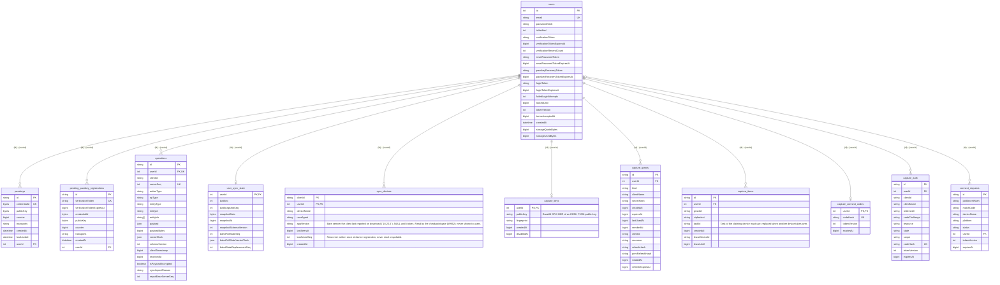

```mermaid
erDiagram
    users ||--o{ passkeys : "(id) - (userId)"
    users ||--o{ pending_passkey_registrations : "(id) - (userId)"
    users ||--o{ operations : "(id) - (userId)"
    users ||--o| user_sync_state : "(id) - (userId)"
    users ||--o{ sync_devices : "(id) - (userId)"
    users ||--o| capture_keys : "(id) - (userId)"
    users ||--o{ capture_grants : "(id) - (userId)"
    users ||--o{ capture_items : "(id) - (userId)"
    users ||--o| capture_connect_codes : "(id) - (userId)"
    users |o--o{ capture_auth : "(id) - (userId)"
    users |o--o{ connect_requests : "(id) - (userId)"
    users {
        int id PK
        string email UK
        string passwordHash
        int isVerified
        string verificationToken
        bigint verificationTokenExpiresAt
        int verificationResendCount
        string resetPasswordToken
        bigint resetPasswordTokenExpiresAt
        string passkeyRecoveryToken
        bigint passkeyRecoveryTokenExpiresAt
        string loginToken
        bigint loginTokenExpiresAt
        int failedLoginAttempts
        bigint lockedUntil
        int tokenVersion
        bigint termsAcceptedAt
        datetime createdAt
        bigint storageQuotaBytes
        bigint storageUsedBytes
    }
    passkeys {
        string id PK
        bytes credentialId UK
        bytes publicKey
        bigint counter
        string transports
        datetime createdAt
        datetime lastUsedAt
        int userId FK
    }
    pending_passkey_registrations {
        string id PK
        string verificationToken UK
        bigint verificationTokenExpiresAt
        bytes credentialId
        bytes publicKey
        bigint counter
        string transports
        datetime createdAt
        int userId FK
    }
    operations {
        string id PK
        int userId FK, UK
        string clientId
        int serverSeq UK
        string actionType
        string opType
        string entityType
        string entityId
        string[] entityIds
        json payload
        bigint payloadBytes
        json vectorClock
        int schemaVersion
        bigint clientTimestamp
        bigint receivedAt
        boolean isPayloadEncrypted
        string syncImportReason
        int repairBaseServerSeq
    }
    user_sync_state {
        int userId PK, FK
        int lastSeq
        int lastSnapshotSeq
        bytes snapshotData
        bigint snapshotAt
        int snapshotSchemaVersion
        int latestFullStateSeq
        json latestFullStateVectorClock
        int latestStateReplacementSeq
    }
    sync_devices {
        string clientId PK
        int userId PK, FK
        string deviceName
        string userAgent
        string appVersion "Bare semver the client last reported on download (`18.22.0`), NULL until it does. Read by the checkpoint gate (#9962); never shown to users."
        bigint lastSeenAt
        int lastAckedSeq "Reserved: written once at device registration, never read or updated."
        bigint createdAt
    }
    capture_keys {
        int userId PK, FK
        string publicKey "Base64 SPKI DER of an ECDH P-256 public key."
        string fingerprint
        bigint createdAt
        bigint disabledAt
    }
    capture_grants {
        string id PK
        int userId FK
        string kind
        string clientName
        string secretHash
        bigint createdAt
        bigint expiresAt
        bigint lastUsedAt
        bigint revokedAt
        string clientId
        string resource
        string refreshHash
        string prevRefreshHash
        bigint rotatedAt
        bigint refreshExpiresAt
    }
    capture_items {
        string id PK
        int userId FK
        string grantId
        string ciphertext
        string taskId "Task id the claiming device must use; replaced when another device takes over."
        bigint createdAt
        string leaseDeviceId
        bigint leaseUntil
    }
    capture_connect_codes {
        int userId PK, FK
        string codeHash UK
        int tokenVersion
        bigint expiresAt
    }
    capture_auth {
        string id PK
        int userId FK
        string clientId
        string clientName
        string redirectUri
        string codeChallenge
        string resource
        string state
        string scope
        string codeHash UK
        int tokenVersion
        bigint expiresAt
    }
    connect_requests {
        string id PK
        string pollSecretHash
        string matchCode
        string deviceName
        string platform
        string status
        int userId FK
        int tokenVersion
        bigint expiresAt
    }
```