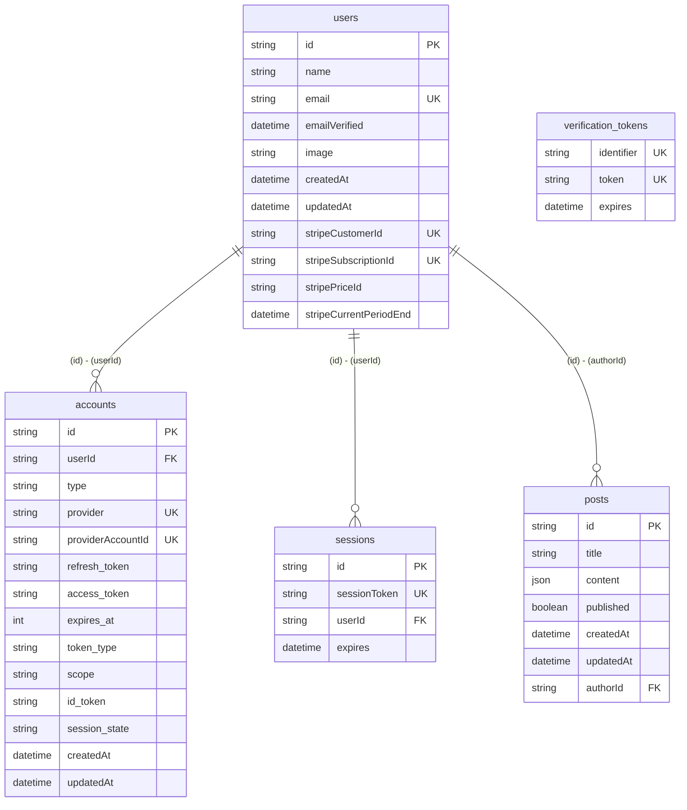

```mermaid
erDiagram
    users ||--o{ accounts : "(id) - (userId)"
    users ||--o{ sessions : "(id) - (userId)"
    users ||--o{ posts : "(id) - (authorId)"
    accounts {
        string id PK
        string userId FK
        string type
        string provider UK
        string providerAccountId UK
        string refresh_token
        string access_token
        int expires_at
        string token_type
        string scope
        string id_token
        string session_state
        datetime createdAt
        datetime updatedAt
    }
    sessions {
        string id PK
        string sessionToken UK
        string userId FK
        datetime expires
    }
    users {
        string id PK
        string name
        string email UK
        datetime emailVerified
        string image
        datetime createdAt
        datetime updatedAt
        string stripeCustomerId UK
        string stripeSubscriptionId UK
        string stripePriceId
        datetime stripeCurrentPeriodEnd
    }
    verification_tokens {
        string identifier UK
        string token UK
        datetime expires
    }
    posts {
        string id PK
        string title
        json content
        boolean published
        datetime createdAt
        datetime updatedAt
        string authorId FK
    }
```