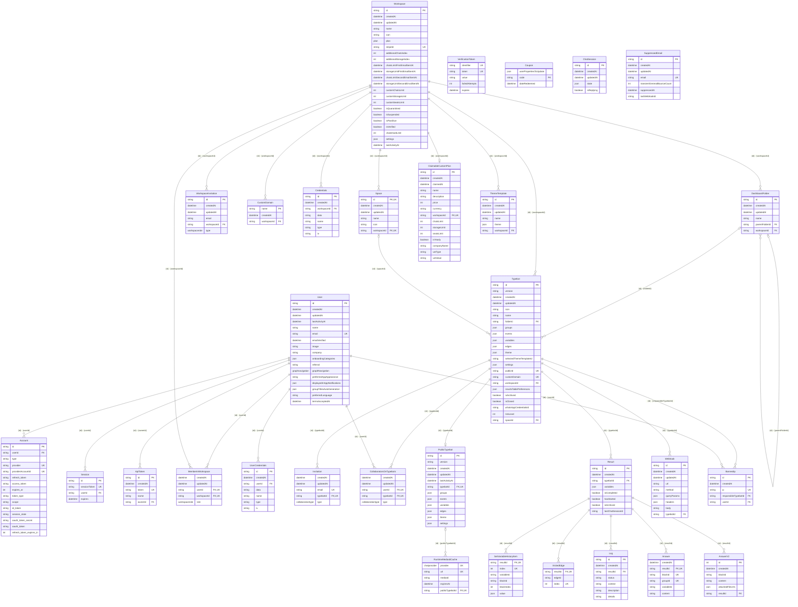

```mermaid
erDiagram
    User ||--o{ Account : "(id) - (userId)"
    User ||--o{ Session : "(id) - (userId)"
    User ||--o{ ApiToken : "(id) - (ownerId)"
    Workspace ||--o{ Space : "(id) - (workspaceId)"
    User ||--o{ MemberInWorkspace : "(id) - (userId)"
    Workspace ||--o{ MemberInWorkspace : "(id) - (workspaceId)"
    Workspace ||--o{ WorkspaceInvitation : "(id) - (workspaceId)"
    Workspace ||--o{ CustomDomain : "(id) - (workspaceId)"
    Workspace ||--o{ Credentials : "(id) - (workspaceId)"
    User ||--o{ UserCredentials : "(id) - (userId)"
    DashboardFolder |o--o{ DashboardFolder : "(id) - (parentFolderId)"
    Workspace ||--o{ DashboardFolder : "(id) - (workspaceId)"
    DashboardFolder |o--o{ Typebot : "(id) - (folderId)"
    Workspace ||--o{ Typebot : "(id) - (workspaceId)"
    Space |o--o{ Typebot : "(id) - (spaceId)"
    Typebot ||--o{ Invitation : "(id) - (typebotId)"
    Typebot ||--o{ CollaboratorsOnTypebots : "(id) - (typebotId)"
    User ||--o{ CollaboratorsOnTypebots : "(id) - (userId)"
    Typebot ||--o| PublicTypebot : "(id) - (typebotId)"
    PublicTypebot |o--o{ RuntimeMediaIdCache : "(id) - (publicTypebotId)"
    Typebot ||--o{ Result : "(id) - (typebotId)"
    Result ||--o{ SetVariableHistoryItem : "(id) - (resultId)"
    Result ||--o{ VisitedEdge : "(id) - (resultId)"
    Result ||--o{ Log : "(id) - (resultId)"
    Result ||--o{ Answer : "(id) - (resultId)"
    Result ||--o{ AnswerV2 : "(id) - (resultId)"
    Typebot ||--o{ Webhook : "(id) - (typebotId)"
    Workspace ||--o| ClaimableCustomPlan : "(id) - (workspaceId)"
    Workspace ||--o{ ThemeTemplate : "(id) - (workspaceId)"
    Typebot ||--o{ BannedIp : "(id) - (responsibleTypebotId)"
    User ||--o{ BannedIp : "(id) - (userId)"
    Account {
        string id PK
        string userId FK
        string type
        string provider UK
        string providerAccountId UK
        string refresh_token
        string access_token
        int expires_at
        string token_type
        string scope
        string id_token
        string session_state
        string oauth_token_secret
        string oauth_token
        int refresh_token_expires_in
    }
    Session {
        string id PK
        string sessionToken UK
        string userId FK
        datetime expires
    }
    User {
        string id PK
        datetime createdAt
        datetime updatedAt
        datetime lastActivityAt
        string name
        string email UK
        datetime emailVerified
        string image
        string company
        json onboardingCategories
        string referral
        graphnavigation graphNavigation
        string preferredAppAppearance
        json displayedInAppNotifications
        json groupTitlesAutoGeneration
        string preferredLanguage
        datetime termsAcceptedAt
    }
    ApiToken {
        string id PK
        datetime createdAt
        string token UK
        string name
        string ownerId FK
    }
    Workspace {
        string id PK
        datetime createdAt
        datetime updatedAt
        string name
        string icon
        plan plan
        string stripeId UK
        int additionalChatsIndex
        int additionalStorageIndex
        datetime chatsLimitFirstEmailSentAt
        datetime storageLimitFirstEmailSentAt
        datetime chatsLimitSecondEmailSentAt
        datetime storageLimitSecondEmailSentAt
        int customChatsLimit
        int customStorageLimit
        int customSeatsLimit
        boolean isQuarantined
        boolean isSuspended
        boolean isPastDue
        boolean isVerified
        int chatsHardLimit
        json settings
        datetime lastActivityAt
    }
    Space {
        string id PK, UK
        datetime createdAt
        datetime updatedAt
        string name
        string icon
        string workspaceId FK, UK
    }
    MemberInWorkspace {
        datetime createdAt
        datetime updatedAt
        string userId FK, UK
        string workspaceId FK, UK
        workspacerole role
    }
    WorkspaceInvitation {
        string id PK
        datetime createdAt
        datetime updatedAt
        string email
        string workspaceId FK
        workspacerole type
    }
    CustomDomain {
        string name PK
        datetime createdAt
        string workspaceId FK
    }
    Credentials {
        string id PK
        datetime createdAt
        string workspaceId FK
        string data
        string name
        string type
        string iv
    }
    UserCredentials {
        string id PK
        datetime createdAt
        string userId FK
        string data
        string name
        string type
        string iv
    }
    VerificationToken {
        string identifier UK
        string token UK
        string value
        int failedAttempts
        datetime expires
    }
    DashboardFolder {
        string id PK
        datetime createdAt
        datetime updatedAt
        string name
        string parentFolderId FK
        string workspaceId FK
    }
    Typebot {
        string id PK
        string version
        datetime createdAt
        datetime updatedAt
        string icon
        string name
        string folderId FK
        json groups
        json events
        json variables
        json edges
        json theme
        string selectedThemeTemplateId
        json settings
        string publicId UK
        string customDomain UK
        string workspaceId FK
        json resultsTablePreferences
        boolean isArchived
        boolean isClosed
        string whatsAppCredentialsId
        int riskLevel
        string spaceId FK
    }
    Invitation {
        datetime createdAt
        datetime updatedAt
        string email UK
        string typebotId FK, UK
        collaborationtype type
    }
    CollaboratorsOnTypebots {
        datetime createdAt
        datetime updatedAt
        string userId FK, UK
        string typebotId FK, UK
        collaborationtype type
    }
    PublicTypebot {
        string id PK
        string version
        datetime createdAt
        datetime updatedAt
        datetime lastActivityAt
        string typebotId FK, UK
        json groups
        json events
        json variables
        json edges
        json theme
        json settings
    }
    RuntimeMediaIdCache {
        chatprovider provider UK
        string url UK
        string mediaId
        datetime expiresAt
        string publicTypebotId FK, UK
    }
    Result {
        string id PK
        datetime createdAt
        string typebotId FK
        json variables
        boolean isCompleted
        boolean hasStarted
        boolean isArchived
        string lastChatSessionId
    }
    SetVariableHistoryItem {
        string resultId FK, UK
        int index UK
        string variableId
        string blockId
        int blockIndex
        json value
    }
    VisitedEdge {
        string resultId FK, UK
        string edgeId
        int index UK
    }
    Log {
        string id PK
        datetime createdAt
        string resultId FK
        string status
        string context
        string description
        string details
    }
    Answer {
        datetime createdAt
        string resultId FK, UK
        string blockId UK
        string groupId UK
        string variableId
        string content
    }
    AnswerV2 {
        int id PK
        datetime createdAt
        string blockId
        string content
        json attachedFileUrls
        string resultId FK
    }
    Coupon {
        json userPropertiesToUpdate
        string code PK
        datetime dateRedeemed
    }
    Webhook {
        string id PK
        datetime createdAt
        datetime updatedAt
        string url
        string method
        json queryParams
        json headers
        string body
        string typebotId FK
    }
    ClaimableCustomPlan {
        string id PK
        datetime createdAt
        datetime claimedAt
        string name
        string description
        int price
        string currency
        string workspaceId FK, UK
        int chatsLimit
        int storageLimit
        int seatsLimit
        boolean isYearly
        string companyName
        string vatType
        string vatValue
    }
    ChatSession {
        string id PK
        datetime createdAt
        datetime updatedAt
        json state
        boolean isReplying
    }
    ThemeTemplate {
        string id PK
        datetime createdAt
        datetime updatedAt
        string name
        json theme
        string workspaceId FK
    }
    BannedIp {
        string id PK
        datetime createdAt
        string ip UK
        string responsibleTypebotId FK
        string userId FK
    }
    SuppressedEmail {
        string id PK
        datetime createdAt
        datetime updatedAt
        string email UK
        int transientGeneralBounceCount
        datetime suppressedAt
        string lastWebhookId
    }
```