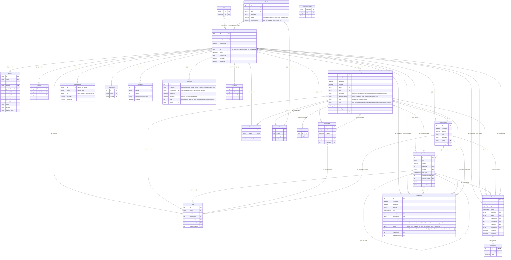

```mermaid
erDiagram
    User ||--o{ Account : "(id) - (userId)"
    User ||--o{ Session : "(id) - (userId)"
    User ||--o{ Challenge : "(id) - (userId)"
    User ||--o{ Vote : "(id) - (userId)"
    Challenge |o--o{ Vote : "(id) - (challengeId)"
    Comment |o--o{ Vote : "(id) - (commentId)"
    Submission |o--o{ Vote : "(id) - (submissionId)"
    SharedSolution |o--o{ Vote : "(id) - (sharedSolutionId)"
    User |o--o{ SharedSolution : "(id) - (userId)"
    Challenge |o--o{ SharedSolution : "(id) - (challengeId)"
    User ||--o{ Submission : "(id) - (userId)"
    Challenge ||--o{ Submission : "(id) - (challengeId)"
    User ||--o{ Bookmark : "(id) - (userId)"
    Challenge |o--o{ Bookmark : "(id) - (challengeId)"
    Report ||--o{ ReportIssue : "(id) - (reportId)"
    User ||--o{ Report : "(id) - (reporterId)"
    User |o--o{ Report : "(id) - (userId)"
    Challenge |o--o{ Report : "(id) - (challengeId)"
    Comment |o--o{ Report : "(id) - (commentId)"
    SharedSolution |o--o{ Report : "(id) - (solutionId)"
    User |o--o{ Report : "(id) - (moderatorId)"
    Comment |o--o{ Comment : "(id) - (parentId)"
    User ||--o{ Comment : "(id) - (userId)"
    Challenge |o--o{ Comment : "(id) - (rootChallengeId)"
    SharedSolution |o--o{ Comment : "(id) - (rootSolutionId)"
    User ||--o{ ImageUpload : "(id) - (userId)"
    Challenge ||--o{ TrackChallenge : "(id) - (challengeId)"
    Track |o--o{ TrackChallenge : "(id) - (trackId)"
    User |o--o{ BetaTokens : "(id) - (userId)"
    User ||--o{ Donation : "(id) - (userId)"
    User ||--o{ Notification : "(id) - (toUserId)"
    User ||--o{ Notification : "(id) - (fromUserId)"
    Comment |o--o{ Notification : "(id) - (commentId)"
    Challenge |o--o{ Notification : "(id) - (challengeId)"
    SharedSolution |o--o{ Notification : "(id) - (sharedSolutionId)"
    User |o--o{ ShortURL : "(id) - (userId)"
    Role }o--o{ User : "(user) - (roles)"
    User }o--o{ UserLink : "(userLinks) - (user)"
    Challenge }o--o{ Tag : "(tags) - (challenges)"
    Track }o--o{ User : "(enrolledUsers) - (tracks)"
    Account {
        string id PK
        string userId FK
        string type
        string provider UK
        string providerAccountId UK
        string refresh_token
        string access_token
        int expires_at
        string token_type
        string scope
        string id_token
        string session_state
    }
    Session {
        string id PK
        string sessionToken UK
        string userId FK
        datetime expires
    }
    Role {
        string id PK
        roletypes role UK
    }
    UserLink {
        string id PK
        string url
        datetime createdAt
        datetime updatedAt
    }
    User {
        string id PK
        string name
        string email UK
        datetime emailVerified
        string image
        string bio "this is the bio that shows up on the profile page"
        userstatus status
        string banReason
        datetime createdAt
        datetime updatedAt
    }
    VerificationToken {
        string identifier UK
        string token UK
        datetime expires
    }
    Tag {
        string id PK
        tags tag UK
    }
    Challenge {
        int id PK
        datetime createdAt
        datetime updatedAt
        difficulty difficulty
        string name UK
        string slug UK
        string description "this is the description to describe the challenge on description panel"
        string shortDescription "this is a short blue thats shown on the explore card"
        string code "Starter code for the challenge"
        string tests "Test cases that need to be passed in order have the submission be accepted."
        challengestatus status
        json tsconfig
        string userId FK
    }
    Vote {
        int id PK
        string userId FK
        votetype rootType
        int challengeId FK
        int commentId FK
        int submissionId FK
        int sharedSolutionId FK
    }
    SharedSolution {
        int id PK
        datetime createdAt
        boolean isPinned
        string title
        string description
        string userId FK
        int challengeId FK
    }
    Submission {
        int id PK
        string code
        datetime createdAt
        boolean isSuccessful
        string userId FK
        int challengeId FK
    }
    Bookmark {
        int id PK
        string userId FK, UK
        int challengeId FK, UK
        datetime createdAt
    }
    ReportIssue {
        int id PK, UK
        int reportId FK
        issuetype type
    }
    Report {
        int id PK, UK
        string text
        reporttype type
        reportstatus status
        string reporterId FK
        string userId FK
        int challengeId FK
        int commentId FK
        int solutionId FK
        string moderatorId FK
        datetime createdAt
        datetime updatedAt
    }
    Comment {
        int id PK
        string text
        boolean visible
        int parentId FK
        string userId FK
        commentroot rootType
        int rootChallengeId FK
        int rootSolutionId FK
        datetime createdAt
        datetime updatedAt
    }
    ImageUpload {
        string id PK "the id of the db row"
        string userId FK "the user id fk"
        string url "the url to the s3 uploaded assets"
        datetime createdAt
        datetime updatedAt
    }
    TrackChallenge {
        int id PK
        int orderId
        int challengeId FK
        int trackId FK
    }
    Track {
        int id PK
        string name UK
        string slug UK
        string description
        boolean visible "determines if a track can be seen on tracks page"
        boolean isComingSoon "use this to display coming soon UI"
    }
    BetaTokens {
        int id PK
        string token UK
        string userId FK
    }
    Donation {
        int id PK
        string userId FK
        int amount
        string stripeCheckoutSessionId UK
        datetime createdAt
    }
    Notification {
        int id PK
        datetime createdAt
        datetime updatedAt
        boolean isRead
        notificationtype type
        string toUserId FK
        string fromUserId FK
        int commentId FK
        string content "could be comment text or solution title to avoid having to join to grab this data"
        string blurb "can be used to replace the blurb (eg: mention you in a comment)"
        string url "use this instead of building the url on the fly (avoids a lot of joins and perf hits to build a string)"
        int challengeId FK
        int sharedSolutionId FK
    }
    ShortURL {
        int id PK
        string originalUrl "the original full url that we want to shorten e.g. https://www.url.com"
        string shortUrlSlug UK "slug for the short url e.g. url.com/[shortUrlSlug]"
        datetime createdAt
        datetime expiresAt "the time the short url will expire"
        int clicks "the number of times the short url has redirected to the original url"
        string userId FK
    }
```