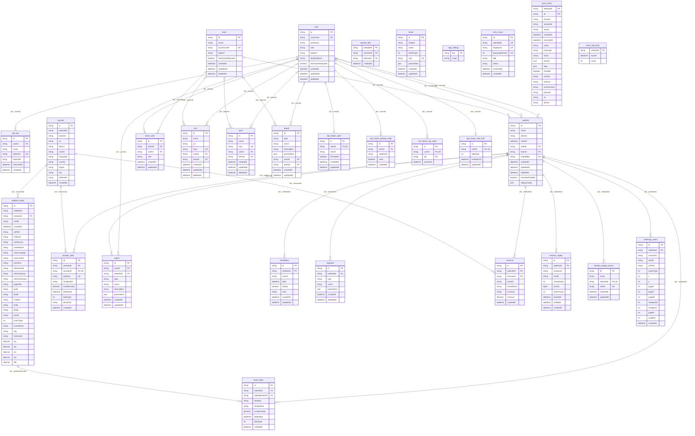

```mermaid
erDiagram
    user ||--o{ api_key : "(id) - (userId)"
    user |o--o{ website : "(id) - (userId)"
    user |o--o{ website : "(id) - (createdBy)"
    team |o--o{ website : "(id) - (teamId)"
    session ||--o{ website_event : "(id) - (sessionId)"
    website ||--o{ event_data : "(id) - (websiteId)"
    website_event ||--o{ event_data : "(id) - (websiteEventId)"
    website ||--o{ session_data : "(id) - (websiteId)"
    session ||--o{ session_data : "(id) - (sessionId)"
    team ||--o{ team_user : "(id) - (teamId)"
    user ||--o{ team_user : "(id) - (userId)"
    user ||--o{ report : "(id) - (userId)"
    website ||--o{ report : "(id) - (websiteId)"
    website ||--o{ annotation : "(id) - (websiteId)"
    website ||--o{ segment : "(id) - (websiteId)"
    website ||--o{ revenue : "(id) - (websiteId)"
    session ||--o{ revenue : "(id) - (sessionId)"
    user |o--o{ link : "(id) - (userId)"
    team |o--o{ link : "(id) - (teamId)"
    user |o--o{ pixel : "(id) - (userId)"
    team |o--o{ pixel : "(id) - (teamId)"
    user |o--o{ board : "(id) - (userId)"
    team |o--o{ board : "(id) - (teamId)"
    website ||--o{ session_replay : "(id) - (websiteId)"
    website ||--o{ session_replay_saved : "(id) - (websiteId)"
    website ||--o{ heatmap_event : "(id) - (websiteId)"
    user ||--o| two_factor_auth : "(id) - (userId)"
    user ||--o{ two_factor_backup_code : "(id) - (userId)"
    user ||--o{ two_factor_otp_used : "(id) - (userId)"
    user ||--o| two_factor_rate_limit : "(id) - (userId)"
    user {
        string id PK
        string username UK
        string password
        string role
        string logoUrl
        string displayName
        boolean twoFactorRequired
        datetime createdAt
        datetime updatedAt
        datetime deletedAt
    }
    api_key {
        string id PK
        string userId FK
        string name
        string keyHash UK
        string keyPrefix
        datetime lastUsedAt
        datetime createdAt
    }
    session {
        string id PK
        string websiteId
        string browser
        string os
        string device
        string screen
        string language
        string country
        string region
        string city
        string distinctId
        datetime createdAt
    }
    session_link {
        string websiteId PK
        string sessionId PK
        string distinctId PK
        datetime createdAt
    }
    website {
        string id PK
        string name
        string domain
        datetime resetAt
        string userId FK
        string teamId FK
        string createdBy FK
        datetime createdAt
        datetime updatedAt
        datetime deletedAt
        boolean recorderEnabled
        json replayConfig
    }
    website_event {
        string id PK
        string websiteId
        string sessionId FK
        string visitId
        datetime createdAt
        string urlPath
        string urlQuery
        string utmSource
        string utmMedium
        string utmCampaign
        string utmContent
        string utmTerm
        string referrerPath
        string referrerQuery
        string referrerDomain
        string pageTitle
        string gclid
        string fbclid
        string msclkid
        string ttclid
        string lifatid
        string twclid
        int eventType
        string eventName
        string tag
        string hostname
        decimal lcp
        decimal inp
        decimal cls
        decimal fcp
        decimal ttfb
    }
    event_data {
        string id PK
        string websiteId FK
        string websiteEventId FK
        string dataKey
        string stringValue
        decimal numberValue
        datetime dateValue
        int dataType
        datetime createdAt
    }
    session_data {
        string id PK
        string websiteId FK
        string sessionId FK, UK
        string dataKey UK
        string stringValue
        decimal numberValue
        datetime dateValue
        int dataType
        string distinctId
        datetime createdAt
    }
    team {
        string id PK
        string name
        string accessCode UK
        string logoUrl
        boolean twoFactorRequired
        datetime createdAt
        datetime updatedAt
        datetime deletedAt
    }
    team_user {
        string id PK
        string teamId FK
        string userId FK
        string role
        datetime createdAt
        datetime updatedAt
    }
    report {
        string id PK
        string userId FK
        string websiteId FK
        string type
        string name
        string description
        json parameters
        datetime createdAt
        datetime updatedAt
    }
    annotation {
        string id PK
        string websiteId FK
        string userId
        datetime date
        boolean allDay
        string note
        datetime createdAt
        datetime updatedAt
    }
    segment {
        string id PK
        string websiteId FK
        string type
        string name
        json parameters
        datetime createdAt
        datetime updatedAt
    }
    revenue {
        string id PK
        string websiteId FK
        string sessionId FK
        string eventId
        string eventName
        string currency
        decimal revenue
        datetime createdAt
    }
    link {
        string id PK
        string name
        string url
        string slug UK
        string userId FK
        string teamId FK
        datetime createdAt
        datetime updatedAt
        datetime deletedAt
    }
    pixel {
        string id PK
        string name
        string slug UK
        string userId FK
        string teamId FK
        datetime createdAt
        datetime updatedAt
        datetime deletedAt
    }
    board {
        string id PK
        string type
        string name
        string description
        json parameters
        string userId FK
        string teamId FK
        datetime createdAt
        datetime updatedAt
    }
    share {
        string id PK
        string entityId
        string name
        int shareType
        string slug UK
        json parameters
        datetime createdAt
        datetime updatedAt
    }
    session_replay {
        string id PK
        string websiteId FK
        string sessionId
        string visitId
        int chunkIndex
        bytes events
        int eventCount
        datetime startedAt
        datetime endedAt
        datetime createdAt
    }
    session_replay_saved {
        string id PK
        string name
        string websiteId FK, UK
        string visitId UK
        datetime createdAt
        datetime updatedAt
    }
    heatmap_event {
        string id PK
        string websiteId FK
        string sessionId
        string visitId
        string urlPath
        int eventType
        int x
        int y
        int pageX
        int pageY
        int pageW
        int viewportW
        int viewportH
        int pageH
        int scrollPct
        datetime createdAt
    }
    two_factor_auth {
        string id PK
        string userId FK, UK
        string secret
        boolean isEnabled
        datetime createdAt
        datetime updatedAt
    }
    two_factor_backup_code {
        string id PK
        string userId FK
        string codeHash
        boolean used
        datetime createdAt
    }
    two_factor_otp_used {
        string id PK
        string userId FK, UK
        string otp UK
        datetime expiresAt
    }
    two_factor_rate_limit {
        string id PK
        string userId FK, UK
        int attempts
        datetime lockedUntil
        datetime updatedAt
    }
    app_setting {
        string key PK
        string value
    }
    error_issue {
        string id PK
        string websiteId UK
        string fingerprint UK
        int groupingVersion UK
        string title
        string status
        datetime resolvedAt
        datetime createdAt
    }
    error_event {
        string websiteId PK
        string id PK
        string issueId
        string sessionId
        string visitId
        datetime createdAt
        datetime receivedAt
        string name
        string message
        string stack
        json frames
        json tags
        boolean handled
        string urlPath
        string release
        string environment
        string browser
        string os
        string device
    }
    error_rate_limit {
        string websiteId PK
        datetime bucket
        int count
    }
```