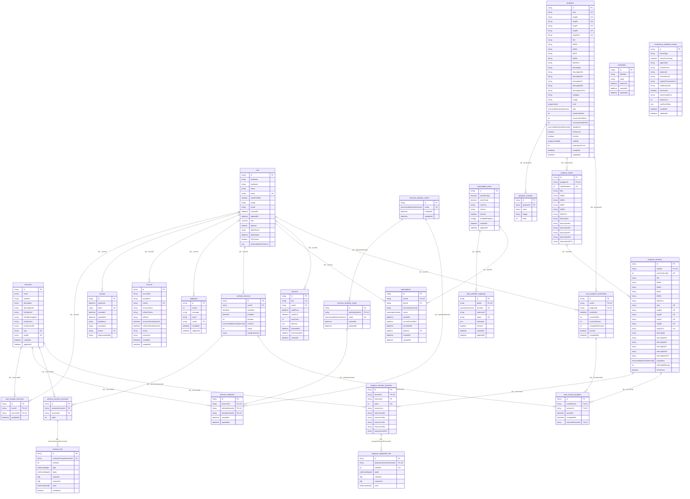

```mermaid
erDiagram
    user ||--o{ user_favorite_exercises : "(id) - (userId)"
    exercises ||--o{ user_favorite_exercises : "(id) - (exerciseId)"
    user ||--o{ session : "(id) - (userId)"
    user ||--o{ account : "(id) - (userId)"
    user |o--o{ feedbacks : "(id) - (userId)"
    exercise_attribute_names ||--o{ exercise_attribute_values : "(id) - (attributeNameId)"
    exercises ||--o{ exercise_attributes : "(id) - (exerciseId)"
    exercise_attribute_names ||--o{ exercise_attributes : "(id) - (attributeNameId)"
    exercise_attribute_values ||--o{ exercise_attributes : "(id) - (attributeValueId)"
    user ||--o{ workout_sessions : "(id) - (userId)"
    workout_sessions ||--o{ workout_session_exercises : "(id) - (workoutSessionId)"
    exercises ||--o{ workout_session_exercises : "(id) - (exerciseId)"
    workout_session_exercises ||--o{ workout_sets : "(id) - (workoutSessionExerciseId)"
    subscription_plans ||--o{ plan_provider_mappings : "(id) - (planId)"
    user ||--o{ subscriptions : "(id) - (userId)"
    subscription_plans ||--o{ subscriptions : "(id) - (planId)"
    user |o--o{ licenses : "(id) - (userId)"
    programs ||--o{ program_coaches : "(id) - (programId)"
    programs ||--o{ program_weeks : "(id) - (programId)"
    program_weeks ||--o{ program_sessions : "(id) - (weekId)"
    program_sessions ||--o{ program_session_exercises : "(id) - (sessionId)"
    exercises ||--o{ program_session_exercises : "(id) - (exerciseId)"
    program_session_exercises ||--o{ program_suggested_sets : "(id) - (programSessionExerciseId)"
    user ||--o{ user_program_enrollments : "(id) - (userId)"
    programs ||--o{ user_program_enrollments : "(id) - (programId)"
    user_program_enrollments ||--o{ user_session_progress : "(id) - (enrollmentId)"
    program_sessions ||--o{ user_session_progress : "(id) - (sessionId)"
    workout_sessions |o--o| user_session_progress : "(id) - (workoutSessionId)"
    user {
        string id PK
        string firstName
        string lastName
        string name
        string email UK
        boolean emailVerified
        string image
        string locale
        datetime createdAt
        datetime updatedAt
        userrole role
        boolean banned
        string banReason
        datetime banExpires
        boolean isPremium
        json onboardingPreferences
    }
    user_favorite_exercises {
        string id PK
        string userId FK, UK
        string exerciseId FK, UK
        datetime updatedAt
    }
    session {
        string id PK
        datetime expiresAt
        string token UK
        datetime createdAt
        datetime updatedAt
        string ipAddress
        string userAgent
        string userId FK
        string impersonatedBy
    }
    account {
        string id PK
        string accountId
        string providerId
        string userId FK
        string accessToken
        string refreshToken
        string idToken
        datetime accessTokenExpiresAt
        datetime refreshTokenExpiresAt
        string scope
        string password
        datetime createdAt
        datetime updatedAt
    }
    verification {
        string id PK
        string identifier
        string value
        datetime expiresAt
        datetime createdAt
        datetime updatedAt
    }
    feedbacks {
        string id PK
        int review
        string message
        string email
        string userId FK
        datetime createdAt
        datetime updatedAt
    }
    exercises {
        string id PK
        string name
        string nameEn
        string description
        string descriptionEn
        string fullVideoUrl
        string fullVideoImageUrl
        string introduction
        string introductionEn
        string slug UK
        string slugEn UK
        datetime createdAt
        datetime updatedAt
    }
    exercise_attribute_names {
        string id PK
        exerciseattributenameenum name UK
        datetime createdAt
        datetime updatedAt
    }
    exercise_attribute_values {
        string id PK
        string attributeNameId FK, UK
        exerciseattributevalueenum value UK
        datetime createdAt
        datetime updatedAt
    }
    exercise_attributes {
        string id PK
        string exerciseId FK, UK
        string attributeNameId FK, UK
        string attributeValueId FK, UK
        datetime createdAt
        datetime updatedAt
    }
    workout_sessions {
        string id PK
        string userId FK
        datetime startedAt
        datetime endedAt
        int duration
        exerciseattributevalueenum[] muscles
        int rating
        string ratingComment
    }
    workout_session_exercises {
        string id PK
        string workoutSessionId FK
        string exerciseId FK
        int order
    }
    workout_sets {
        string id PK
        string workoutSessionExerciseId FK
        int setIndex
        workoutsettype type
        workoutsettype[] types
        int[] valuesInt
        int[] valuesSec
        workoutsetunit[] units
        boolean completed
    }
    subscription_plans {
        string id PK
        decimal priceMonthly
        decimal priceYearly
        string currency
        string interval
        boolean isActive
        string[] availableRegions
        datetime createdAt
        datetime updatedAt
    }
    plan_provider_mappings {
        string id PK
        string planId FK, UK
        paymentprocessor provider UK
        string externalId
        string region UK
        json metadata
        boolean isActive
        datetime createdAt
        datetime updatedAt
    }
    subscriptions {
        string id PK
        string userId FK, UK
        string planId FK
        string revenueCatUserId
        subscriptionstatus status
        datetime startedAt
        datetime currentPeriodEnd
        datetime cancelledAt
        platform platform UK
        datetime createdAt
        datetime updatedAt
    }
    licenses {
        string id PK
        string key UK
        string userId FK
        datetime validFrom
        datetime validUntil
        int maxUsers
        json features
        datetime activatedAt
        datetime lastCheckedAt
        datetime createdAt
    }
    revenuecat_webhook_events {
        string id PK
        string eventType
        datetime eventTimestamp
        string appUserId
        string environment
        string productId
        string transactionId
        string originalTransactionId
        string entitlementIds
        boolean processed
        string processingError
        int retryCount
        json rawEventData
        datetime createdAt
        datetime updatedAt
    }
    programs {
        string id PK
        string slug UK
        string slugEn UK
        string slugEs UK
        string slugPt UK
        string slugRu UK
        string slugZhCn UK
        string title
        string titleEn
        string titleEs
        string titlePt
        string titleRu
        string titleZhCn
        string description
        string descriptionEn
        string descriptionEs
        string descriptionPt
        string descriptionRu
        string descriptionZhCn
        string category
        string image
        programlevel level
        exerciseattributevalueenum type
        int durationWeeks
        int sessionsPerWeek
        int sessionDurationMin
        exerciseattributevalueenum[] equipment
        boolean isPremium
        boolean isActive
        programvisibility visibility
        int participantCount
        datetime createdAt
        datetime updatedAt
    }
    program_coaches {
        string id PK
        string programId FK
        string name
        string image
        int order
    }
    program_weeks {
        string id PK
        string programId FK, UK
        int weekNumber UK
        string title
        string titleEn
        string titleEs
        string titlePt
        string titleRu
        string titleZhCn
        string description
        string descriptionEn
        string descriptionEs
        string descriptionPt
        string descriptionRu
        string descriptionZhCn
    }
    program_sessions {
        string id PK
        string weekId FK, UK
        int sessionNumber UK
        string title
        string titleEn
        string titleEs
        string titlePt
        string titleRu
        string titleZhCn
        string slug UK
        string slugEn UK
        string slugEs UK
        string slugPt UK
        string slugRu UK
        string slugZhCn UK
        string description
        string descriptionEn
        string descriptionEs
        string descriptionPt
        string descriptionRu
        string descriptionZhCn
        exerciseattributevalueenum[] equipment
        int estimatedMinutes
        boolean isPremium
    }
    program_session_exercises {
        string id PK
        string sessionId FK, UK
        string exerciseId FK
        int order UK
        string instructions
        string instructionsEn
        string instructionsEs
        string instructionsPt
        string instructionsRu
        string instructionsZhCn
    }
    program_suggested_sets {
        string id PK
        string programSessionExerciseId FK, UK
        int setIndex UK
        workoutsettype[] types
        int[] valuesInt
        int[] valuesSec
        workoutsetunit[] units
    }
    user_program_enrollments {
        string id PK
        string userId FK, UK
        string programId FK, UK
        datetime enrolledAt
        int currentWeek
        int currentSession
        int completedSessions
        boolean isActive
        datetime completedAt
    }
    user_session_progress {
        string id PK
        string enrollmentId FK, UK
        string sessionId FK, UK
        datetime startedAt
        datetime completedAt
        string workoutSessionId FK, UK
    }
```